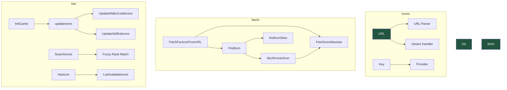
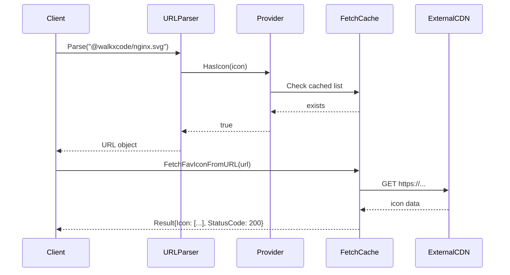

# Icons Package

Icon URL parsing, fetching, and listing for the homepage dashboard.

## Overview

The icons package manages icon resources from multiple sources with support for light/dark variants and multiple image formats. It provides a unified API for parsing icon URLs, checking icon availability, fetching icon data, and searching available icons from CDN repositories.

### Purpose

- Parse and validate icon URLs from various sources
- Fetch icon data with caching and fallback strategies
- Maintain a searchable index of available icons from walkxcode and selfh.st CDNs
- Support light/dark theme variants and multiple image formats (SVG, PNG, WebP)

### Primary Consumers

- `internal/homepage/` - Homepage route management and icon assignment
- `internal/api/` - Icon search and listing API endpoints
- `internal/route/` - Route icon resolution for proxy targets

### Non-goals

- Icon generation or modification (only fetching)
- Authentication for remote icon sources (public CDNs only)
- Icon validation beyond format checking

### Stability

This package exposes a stable public API. Internal implementations (caching strategies, fetch logic) may change without notice.

## Concepts and Terminology

| Term         | Definition                                                                            |
| ------------ | ------------------------------------------------------------------------------------- |
| **Source**   | The origin type of an icon (absolute URL, relative path, walkxcode CDN, selfh.st CDN) |
| **Variant**  | Theme variant: none, light, or dark                                                   |
| **Key**      | Unique identifier combining source and reference (e.g., `@walkxcode/nginx`)           |
| **Meta**     | Metadata describing available formats and variants for an icon                        |
| **Provider** | Interface for checking icon existence without fetching data                           |

## Public API

### Exported Types

#### Source

Source identifies the origin of an icon. Use the constants defined below.

```go
type Source string

const (
    // SourceAbsolute is a full URL (http:// or https://)
    SourceAbsolute Source = "https://"

    // SourceRelative is a path relative to the target service (@target or leading /)
    SourceRelative Source = "@target"

    // SourceWalkXCode is the walkxcode dashboard-icons CDN
    SourceWalkXCode Source = "@walkxcode"

    // SourceSelfhSt is the selfh.st icons CDN
    SourceSelfhSt Source = "@selfhst"
)
```

#### Variant

Variant indicates the theme preference for icons that support light/dark modes.

```go
type Variant string

const (
    VariantNone  Variant = ""     // Default, no variant suffix
    VariantLight Variant = "light" // Light theme variant (-light suffix)
    VariantDark  Variant = "dark"  // Dark theme variant (-dark suffix)
)
```

#### URL

URL represents a parsed icon URL with its source and metadata.

```go
type URL struct {
    // Source identifies the icon origin
    Source `json:"source"`

    // FullURL contains the resolved URL for absolute/relative sources
    FullURL *string `json:"value,omitempty"`

    // Extra contains metadata for CDN sources (walkxcode/selfhst)
    Extra *Extra `json:"extra,omitempty"`
}
```

**URL Methods:**

- `Parse(v string) error` - Parses an icon URL string (implements `strutils.Parser`)
- `URL() string` - Returns the absolute URL for fetching
- `HasIcon() bool` - Checks if the icon exists (requires Provider to be set)
- `WithVariant(variant Variant) *URL` - Returns a new URL with the specified variant
- `String() string` - Returns the original URL representation
- `MarshalText() ([]byte, error)` - Serializes to text (implements `encoding.TextMarshaler`)
- `UnmarshalText(data []byte) error` - Deserializes from text (implements `encoding.TextUnmarshaler`)

#### Extra

Extra contains metadata for icons from CDN sources.

```go
type Extra struct {
    // Key is the unique icon key
    Key Key `json:"key"`

    // Ref is the icon reference name (without variant suffix)
    Ref string `json:"ref"`

    // FileType is the image format: "svg", "png", or "webp"
    FileType string `json:"file_type"`

    // IsLight indicates if this is a light variant
    IsLight bool `json:"is_light"`

    // IsDark indicates if this is a dark variant
    IsDark bool `json:"is_dark"`
}
```

#### Key

Key is a unique identifier for an icon from a specific source.

```go
type Key string

// NewKey creates a key from source and reference
func NewKey(source Source, reference string) Key

// SourceRef extracts the source and reference from a key
func (k Key) SourceRef() (Source, string)
```

#### Meta

Meta stores availability metadata for an icon.

```go
type Meta struct {
    // Available formats
    SVG  bool `json:"SVG"`  // SVG format available
    PNG  bool `json:"PNG"`  // PNG format available
    WebP bool `json:"WebP"` // WebP format available

    // Available variants
    Light bool `json:"Light"` // Light variant available
    Dark  bool `json:"Dark"`  // Dark variant available

    // DisplayName is the human-readable name (selfh.st only)
    DisplayName string `json:"-"`

    // Tag is the category tag (selfh.st only)
    Tag string `json:"-"`
}

// Filenames returns all available filename variants for this icon
func (icon *Meta) Filenames(ref string) []string
```

### Exported Functions

```go
// NewURL creates a URL for a CDN source with the given reference and format
func NewURL(source Source, refOrName, format string) *URL

// ErrInvalidIconURL is returned when icon URL parsing fails
var ErrInvalidIconURL = errors.New("invalid icon url")
```

### Provider Interface

```go
type Provider interface {
    // HasIcon returns true if the icon exists in the provider's catalog
    HasIcon(u *URL) bool
}

// SetProvider sets the global icon provider for existence checks
func SetProvider(p Provider)
```

The provider pattern allows the icons package to check icon existence without fetching data. The `list` subpackage registers a provider that checks against the cached icon list.

## Architecture

### Core Components



### Component Interactions

1. **URL Parsing** (`url.go`): Parses icon URL strings and validates format
2. **Icon Existence** (`provider.go`): Delegates to registered Provider
3. **Icon Fetching** (`fetch/fetch.go`): Fetches icon data with caching
4. **Icon Listing** (`list/list_icons.go`): Maintains cached index of available icons

### Data Flow



## Subpackages

### fetch/

Icon fetching implementation with caching and fallback strategies.

```go
type Result struct {
    Icon       []byte  // Raw icon image data
    StatusCode int     // HTTP status code from fetch
}

// FetchFavIconFromURL fetches an icon from a parsed URL
func FetchFavIconFromURL(ctx context.Context, iconURL *URL) (Result, error)

// FindIcon finds an icon for a route with variant support
func FindIcon(ctx context.Context, r route, uri string, variant Variant) (Result, error)
```

**Key behaviors:**

- `FetchIconAbsolute` is cached with 200 entries and 4-hour TTL
- `findIconSlow` has infinite retries with 15-second backoff
- HTML parsing fallback extracts `<link rel=icon>` from target pages

### list/

Icon catalog management with search and caching.

```go
type IconMap map[Key]*Meta
type IconMetaSearch struct {
    *Meta
    Source Source `json:"Source"`
    Ref    string `json:"Ref"`
    rank   int
}

// InitCache loads icon metadata from cache or remote sources
func InitCache()

// ListAvailableIcons returns the current icon catalog
func ListAvailableIcons() IconMap

// SearchIcons performs fuzzy search on icon names
func SearchIcons(keyword string, limit int) []*IconMetaSearch

// HasIcon checks if an icon exists in the catalog
func HasIcon(icon *URL) bool
```

**Key behaviors:**

- Updates from walkxcode and selfh.st CDNs every 2 hours
- Persists cache to disk for fast startup
- Fuzzy search uses Levenshtein distance ranking

## Configuration

### Cache Location

Icons cache is stored at the path specified by `common.IconListCachePath`.

### Environment Variables

No direct environment variable configuration. Cache is managed internally.

### Reloading

Icon cache updates automatically every 2 hours in the background. Manual refresh requires program restart.

## Observability

### Logs

- `failed to load icons` - Cache load failure at startup
- `icons loaded` - Successful cache load with entry count
- `updating icon data` - Background update started
- `icons list updated` - Successful cache refresh with entry count
- `failed to save icons` - Cache persistence failure

### Metrics

No metrics exposed directly. Status codes in `Result` can be monitored via HTTP handlers.

### Tracing

Standard `context.Context` propagation is used throughout. Fetch operations respect context cancellation and deadlines.

## Security Considerations

- **Input Validation**: Icon URLs are strictly validated for format and source
- **SSRF Protection**: Only absolute URLs passed directly; no arbitrary URL construction
- **Content-Type**: Detected from response headers or inferred from SVG magic bytes
- **Size Limits**: Cache limited to 200 entries; no explicit size limit on icon data
- **Timeouts**: 3-second timeout on favicon fetches, 5-second timeout on list updates

## Performance Characteristics

- **Parsing**: O(1) string parsing with early validation
- **Caching**: LRU-style cache with TTL for fetched icons
- **Background Updates**: Non-blocking updates every 2 hours
- **Search**: O(n) fuzzy match with early exit at rank > 3
- **Memory**: Icon list typically contains ~2000 entries

## Failure Modes and Recovery

| Failure                | Behavior                                 | Recovery                         |
| ---------------------- | ---------------------------------------- | -------------------------------- |
| CDN fetch timeout      | Return cached data or fail               | Automatic retry with backoff     |
| Cache load failure     | Attempt legacy format, then remote fetch | Manual cache reset if persistent |
| Icon not found in list | Return error from Parse                  | User must select valid icon      |
| HTML parse failure     | Return "icon element not found"          | Manual icon selection            |

## Usage Examples

### Basic: Parse and Generate URL

```go
package main

import (
    "fmt"
    "github.com/yusing/godoxy/internal/homepage/icons"
)

func main() {
    // Parse a CDN icon URL
    url := &icons.URL{}
    err := url.Parse("@walkxcode/nginx.svg")
    if err != nil {
        panic(err)
    }

    // Get the actual fetchable URL
    fmt.Println(url.URL())
    // Output: https://cdn.jsdelivr.net/gh/walkxcode/dashboard-icons/svg/nginx.svg

    // Get string representation
    fmt.Println(url.String())
    // Output: @walkxcode/nginx.svg

    // Create with dark variant
    darkUrl := url.WithVariant(icons.VariantDark)
    fmt.Println(darkUrl.URL())
    // Output: https://cdn.jsdelivr.net/gh/walkxcode/dashboard-icons/svg/nginx-dark.svg
}
```

### Advanced: Fetch Icon Data

```go
package main

import (
    "context"
    "fmt"
    "net/http"

    "github.com/yusing/godoxy/internal/homepage/icons/fetch"
)

func main() {
    // Initialize the icon list cache first
    iconlist.InitCache()

    // Parse icon URL
    url := &icons.URL{}
    if err := url.Parse("@walkxcode/nginx.svg"); err != nil {
        panic(err)
    }

    // Fetch icon data
    ctx := context.Background()
    result, err := fetch.FetchFavIconFromURL(ctx, url)
    if err != nil {
        fmt.Printf("Fetch failed: %v\n", err)
        return
    }

    if result.StatusCode != http.StatusOK {
        fmt.Printf("HTTP %d\n", result.StatusCode)
        return
    }

    fmt.Printf("Fetched %d bytes, Content-Type: %s\n",
        len(result.Icon), result.ContentType())
}
```

### Integration: Search Available Icons

```go
package main

import (
    "fmt"

    "github.com/yusing/godoxy/internal/homepage/icons/list"
)

func main() {
    // Initialize cache
    list.InitCache()

    // Search for icons matching a keyword
    results := list.SearchIcons("nginx", 5)

    for _, icon := range results {
        source, ref := icon.Key.SourceRef()
        fmt.Printf("[%s] %s - SVG:%v PNG:%v WebP:%v\n",
            source, ref, icon.SVG, icon.PNG, icon.WebP)
    }
}
```

## Testing Notes

- Unit tests in `url_test.go` validate parsing and serialization
- Test mode (`common.IsTest`) bypasses existence checks
- Mock HTTP in list tests via `MockHTTPGet()`
- Golden tests not used; test fixtures embedded in test cases

## Icon URL Formats

| Format        | Example                        | Output URL                                                            |
| ------------- | ------------------------------ | --------------------------------------------------------------------- |
| Absolute      | `https://example.com/icon.png` | `https://example.com/icon.png`                                        |
| Relative      | `@target/favicon.ico`          | `/favicon.ico`                                                        |
| WalkXCode     | `@walkxcode/nginx.svg`         | `https://cdn.jsdelivr.net/gh/walkxcode/dashboard-icons/svg/nginx.svg` |
| Selfh.st      | `@selfhst/adguard-home.webp`   | `https://cdn.jsdelivr.net/gh/selfhst/icons/webp/adguard-home.webp`    |
| Light variant | `@walkxcode/nginx-light.png`   | `.../nginx-light.png`                                                 |
| Dark variant  | `@walkxcode/nginx-dark.svg`    | `.../nginx-dark.svg`                                                  |
