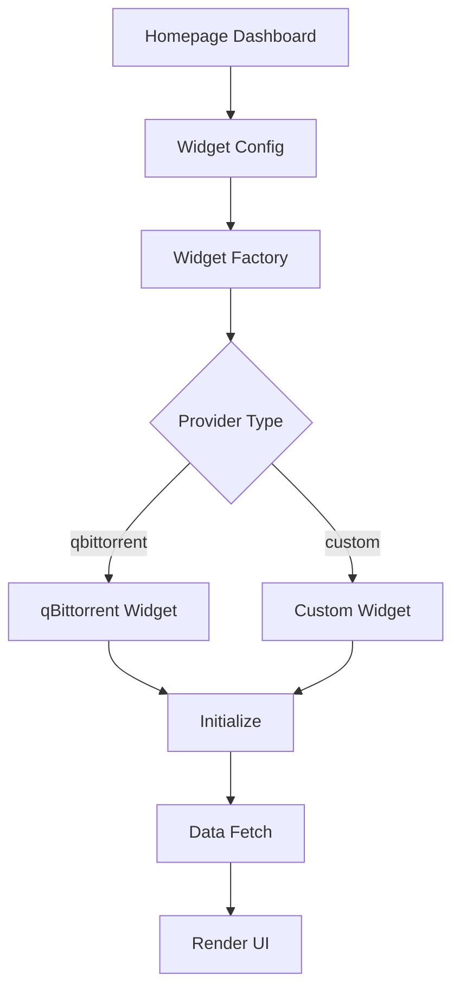

# Homepage Widgets Package

> [!WARNING]
>
> This package is a work in progress and is not stable.

This package provides a widget framework for the GoDoxy homepage dashboard, enabling integration with various service providers to display real-time data.

## Overview

The `internal/homepage/widgets` package defines the widget interface and common utilities for building homepage widgets. It provides a standardized way to integrate external services into the homepage dashboard.

## Architecture

### Core Components

```
widgets/
├── widgets.go    # Widget interface and config
└── http.go       # HTTP client and error definitions
```

### Data Types

```go
type Config struct {
    Provider string `json:"provider"`
    Config   Widget `json:"config"`
}

type Widget interface {
    Initialize(ctx context.Context, url string, cfg map[string]any) error
    Data(ctx context.Context) ([]NameValue, error)
}

type NameValue struct {
    Name  string `json:"name"`
    Value string `json:"value"`
}
```

### Constants

```go
const (
    WidgetProviderQbittorrent = "qbittorrent"
)
```

### Errors

```go
var ErrInvalidProvider = gperr.New("invalid provider")
var ErrHTTPStatus = gperr.New("http status")
```

## API Reference

### Widget Interface

```go
type Widget interface {
    // Initialize sets up the widget with connection configuration
    Initialize(ctx context.Context, url string, cfg map[string]any) error

    // Data returns current widget data as name-value pairs
    Data(ctx context.Context) ([]NameValue, error)
}
```

### Configuration

#### Config.UnmarshalMap

Parses widget configuration from a map.

```go
func (cfg *Config) UnmarshalMap(m map[string]any) error
```

**Parameters:**

- `m` - Map containing `provider` and `config` keys

**Returns:**

- `error` - Parsing or validation error

**Example:**

```go
widgetCfg := widgets.Config{}
err := widgetCfg.UnmarshalMap(map[string]any{
    "provider": "qbittorrent",
    "config": map[string]any{
        "username": "admin",
        "password": "password123",
    },
})
```

### HTTP Client

```go
var HTTPClient = &http.Client{
    Timeout: 10 * time.Second,
}
```

### Available Providers

- **qbittorrent** - qBittorrent torrent client integration (WIP)

## Usage Example

### Creating a Custom Widget

```go
package mywidget

import (
    "context"
    "github.com/yusing/godoxy/internal/homepage/widgets"
)

type MyWidget struct {
    URL      string
    APIKey   string
}

func (m *MyWidget) Initialize(ctx context.Context, url string, cfg map[string]any) error {
    m.URL = url
    m.APIKey = cfg["api_key"].(string)
    return nil
}

func (m *MyWidget) Data(ctx context.Context) ([]widgets.NameValue, error) {
    // Fetch data and return as name-value pairs
    return []widgets.NameValue{
        {Name: "Status", Value: "Online"},
        {Name: "Uptime", Value: "24h"},
    }, nil
}
```

### Registering the Widget

```go
// In widgets initialization
widgetProviders["mywidget"] = struct{}{}
```

### Using the Widget in Homepage

```go
// Fetch widget data
widget := getWidget("qbittorrent")
data, err := widget.Data(ctx)
if err != nil {
    log.Fatal(err)
}

// Display data
for _, nv := range data {
    fmt.Printf("%s: %s\n", nv.Name, nv.Value)
}
```

## Integration with Homepage



## Related Packages

- `internal/homepage/integrations/qbittorrent` - qBittorrent widget implementation
- `internal/serialization` - Configuration unmarshaling utilities
- `github.com/yusing/goutils/errs` - Error handling
