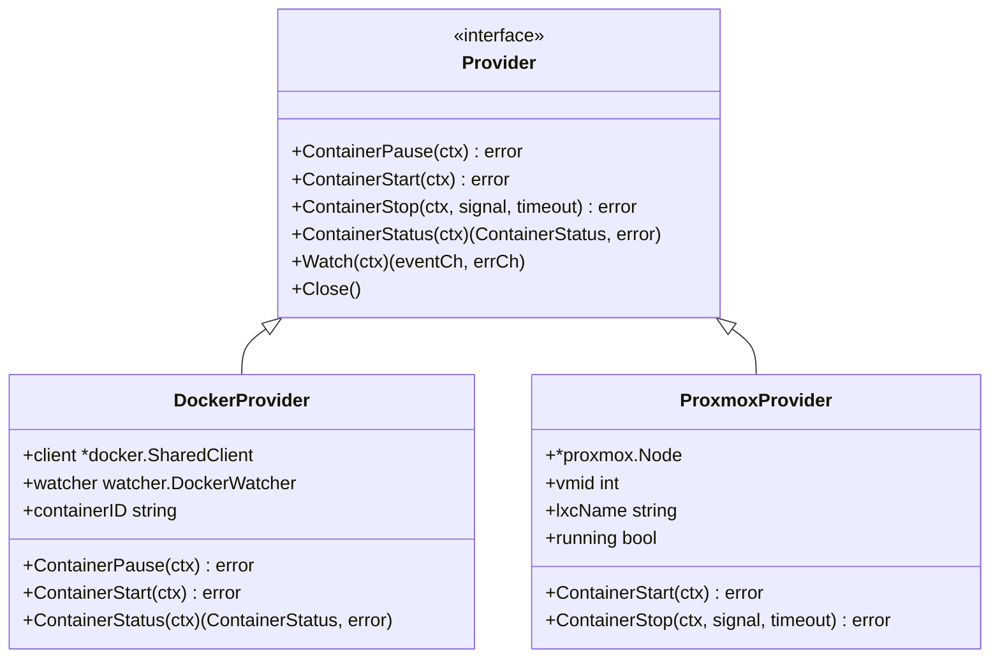
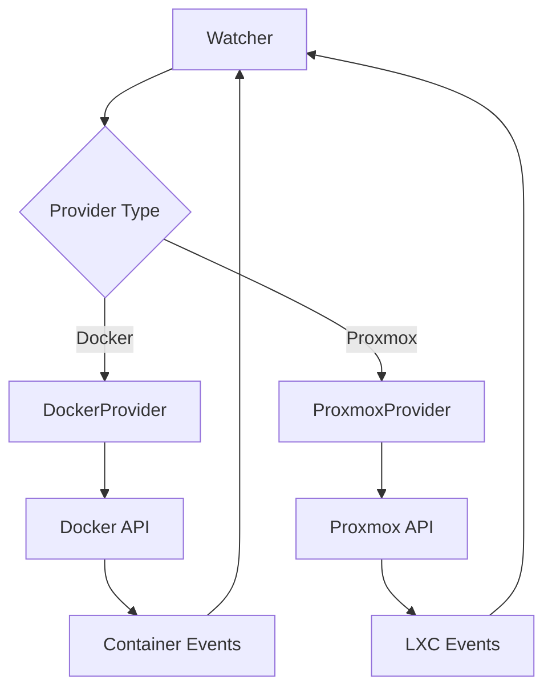

# Idlewatcher Provider

Implements container runtime abstractions for Docker and Proxmox LXC backends.

## Overview

The `internal/idlewatcher/provider` package implements the `idlewatcher.Provider` interface for different container runtimes. It enables the idlewatcher to manage containers regardless of the underlying runtime (Docker or Proxmox LXC).

### Primary Consumers

- **idlewatcher.Watcher**: Uses providers to perform container lifecycle operations
- **Package tests**: Verify provider contract compliance

### Non-goals

- Does not implement idle detection logic
- Does not manage route configuration
- Does not handle health checking

### Stability

Internal package implementing stable `idlewatcher.Provider` interface.

## Public API

### Provider Interface

```go
type Provider interface {
    // Lifecycle operations
    ContainerPause(ctx context.Context) error
    ContainerUnpause(ctx context.Context) error
    ContainerStart(ctx context.Context) error
    ContainerStop(ctx context.Context, signal types.ContainerSignal, timeout int) error
    ContainerKill(ctx context.Context, signal types.ContainerSignal) error

    // Status and monitoring
    ContainerStatus(ctx context.Context) (ContainerStatus, error)
    Watch(ctx context.Context) (eventCh <-chan events.Event, errCh <-chan error)

    // Cleanup
    Close()
}
```

### Container Status

```go
type ContainerStatus string

const (
    ContainerStatusRunning  ContainerStatus = "running"
    ContainerStatusStopped  ContainerStatus = "stopped"
    ContainerStatusPaused   ContainerStatus = "paused"
    ContainerStatusError    ContainerStatus = "error"
)
```

### Exported Functions

```go
// NewDockerProvider creates a provider for Docker containers
func NewDockerProvider(dockerCfg types.DockerProviderConfig, containerID string) (idlewatcher.Provider, error)

// NewProxmoxProvider creates a provider for Proxmox LXC containers
func NewProxmoxProvider(ctx context.Context, nodeName string, vmid int) (idlewatcher.Provider, error)
```

## Architecture

### Core Components



### Component Interactions



## Configuration Surface

### Docker Provider Config

```go
type DockerProviderConfig struct {
    URL       string  // Docker socket URL (unix:///var/run/docker.sock)
    SocketPath string // Alternative socket path
}
```

### Proxmox Provider Config

Provided via `NewProxmoxProvider` parameters:

- `nodeName`: Proxmox node name
- `vmid`: LXC container ID

## Dependency and Integration Map

| Dependency                | Purpose                                |
| ------------------------- | -------------------------------------- |
| `internal/docker`         | Docker client and container operations |
| `internal/proxmox`        | Proxmox API client                     |
| `internal/watcher`        | Event watching for container changes   |
| `internal/watcher/events` | Event types                            |
| `pkg/gperr`               | Error handling                         |

## Observability

### Logs

- **DEBUG**: API calls and responses
- **ERROR**: Operation failures with context

Log context includes: `container`, `vmid`, `action`

## Security Considerations

- Docker provider requires access to Docker socket
- Proxmox provider requires API credentials
- Both handle sensitive container operations

## Failure Modes and Recovery

| Failure                   | Behavior                 | Recovery                    |
| ------------------------- | ------------------------ | --------------------------- |
| Docker socket unavailable | Returns connection error | Fix socket permissions/path |
| Container not found       | Returns not found error  | Verify container ID         |
| Proxmox node unavailable  | Returns API error        | Check network/node          |
| Operation timeout         | Returns timeout error    | Increase timeout or retry   |

## Usage Examples

### Creating a Docker Provider

```go
provider, err := provider.NewDockerProvider(types.DockerProviderConfig{
    SocketPath: "/var/run/docker.sock",
}, "abc123def456")
if err != nil {
    return err
}
defer provider.Close()

// Check container status
status, err := provider.ContainerStatus(ctx)
if err != nil {
    return err
}

// Start container if stopped
if status == idlewatcher.ContainerStatusStopped {
    if err := provider.ContainerStart(ctx); err != nil {
        return err
    }
}
```

### Watching for Container Events

```go
eventCh, errCh := provider.Watch(ctx)

for {
    select {
    case <-ctx.Done():
        return
    case event := <-eventCh:
        log.Printf("Container %s: %s", event.ActorName, event.Action)
    case err := <-errCh:
        log.Printf("Watch error: %v", err)
    }
}
```
