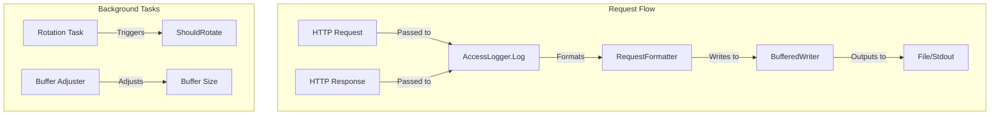
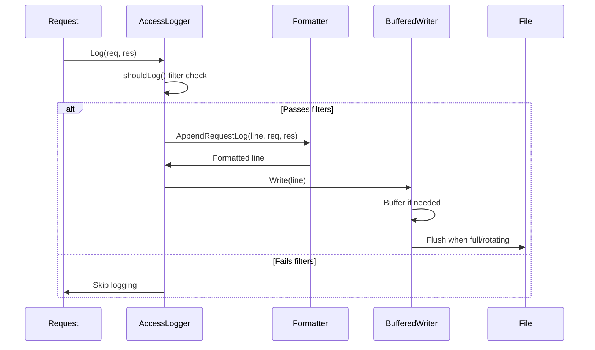
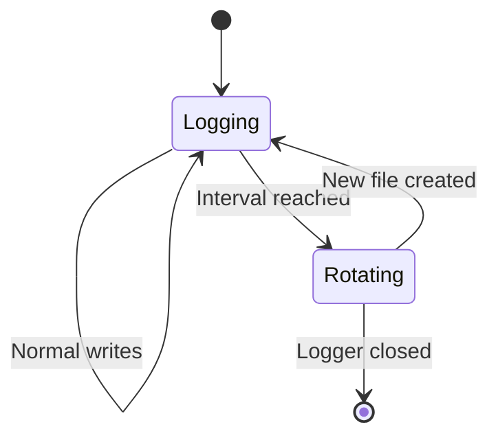

# Access Logging

Provides HTTP access logging with file rotation, log filtering, and multiple output formats for request and ACL event logging.

## Overview

The accesslog package captures HTTP request/response information and writes it to files or stdout. It includes configurable log formats, filtering rules, and automatic log rotation with retention policies.

### Primary Consumers

- `internal/route` - Middleware for logging proxied requests
- `internal/acl` - ACL decision logging
- `internal/api` - Request audit trails

### Non-goals

- Does not provide log parsing or analysis
- Does not implement log aggregation across services
- Does not provide log shipping to external systems
- Does not implement access control (use `internal/acl`)

### Stability

Internal package. Public interfaces are stable.

## Public API

### Exported Types

#### AccessLogger Interface

```go
type AccessLogger interface {
    // Log records an HTTP request and response
    Log(req *http.Request, res *http.Response)

    // LogError logs a request with an error status code
    LogError(req *http.Request, err error)

    // LogACL logs an ACL block/allow event
    LogACL(info *maxmind.IPInfo, blocked bool)

    // Config returns the logger configuration
    Config() *Config

    // Flush forces any buffered log data to be written
    Flush()

    // Close closes the logger and releases resources
    Close() error
}
```

Main interface for logging HTTP requests and ACL events.

#### Writer Interface

```go
type Writer interface {
    io.WriteCloser
    ShouldBeBuffered() bool
    Name() string // file name or path
}
```

Output destination interface.

#### Format Type

```go
type Format string

const (
    FormatCommon   Format = "common"
    FormatCombined Format = "combined"
    FormatJSON     Format = "json"
)
```

Log format constants.

### Configuration Types

#### RequestLoggerConfig

```go
type RequestLoggerConfig struct {
    ConfigBase
    Format  Format  `json:"format" validate:"oneof=common combined json"`
    Filters Filters `json:"filters"`
    Fields  Fields  `json:"fields"`
}
```

Configuration for request/response logging.

#### ACLLoggerConfig

```go
type ACLLoggerConfig struct {
    ConfigBase
    LogAllowed bool `json:"log_allowed"`
}
```

Configuration for ACL event logging.

#### ConfigBase

```go
type ConfigBase struct {
    B              int           `json:"buffer_size"` // Deprecated: buffer size is adjusted dynamically
    Path           string        `json:"path"`
    Stdout         bool          `json:"stdout"`
    Retention      *Retention    `json:"retention" aliases:"keep"`
    RotateInterval time.Duration `json:"rotate_interval,omitempty" swaggertype:"primitive,integer"`
}
```

Common configuration for all loggers.

#### Filters

```go
type Filters struct {
    StatusCodes LogFilter[*StatusCodeRange] `json:"status_codes"`
    Method      LogFilter[HTTPMethod]       `json:"method"`
    Host        LogFilter[Host]             `json:"host"`
    Headers     LogFilter[*HTTPHeader]      `json:"headers"`
    CIDR        LogFilter[*CIDR]            `json:"cidr"`
}
```

Filtering rules for what to log.

#### Fields

```go
type Fields struct {
    Headers FieldConfig `json:"headers" aliases:"header"`
    Query   FieldConfig `json:"query" aliases:"queries"`
    Cookies FieldConfig `json:"cookies" aliases:"cookie"`
}
```

Field configuration for what data to include.

### Exported Functions

#### Constructor

```go
func NewAccessLogger(parent task.Parent, cfg AnyConfig) (AccessLogger, error)
func NewMockAccessLogger(parent task.Parent, cfg *RequestLoggerConfig) AccessLogger
func NewAccessLoggerWithIO(parent task.Parent, writer Writer, anyCfg AnyConfig) AccessLogger
```

Create access loggers from configurations.

#### Default Configurations

```go
func DefaultRequestLoggerConfig() *RequestLoggerConfig
func DefaultACLLoggerConfig() *ACLLoggerConfig
```

Returns default configurations.

## Architecture

### Core Components



| Component          | Responsibility                       |
| ------------------ | ------------------------------------ |
| `AccessLogger`     | Main logging interface               |
| `RequestFormatter` | Formats request/response logs        |
| `ACLFormatter`     | Formats ACL decision logs            |
| `Writer`           | Output destination (file/stdout)     |
| `BufferedWriter`   | Efficient I/O with dynamic buffering |

### Log Flow



### Buffer Management

The logger dynamically adjusts buffer size based on write throughput:

| Parameter           | Value     |
| ------------------- | --------- |
| Initial Buffer Size | 4 KB      |
| Maximum Buffer Size | 8 MB      |
| Adjustment Interval | 5 seconds |

Buffer size adjustment formula:

```go
newBufSize = origBufSize +/- step
step = max(|wps - origBufSize|/2, wps/2)
```

### Rotation Logic



Rotation checks:

1. Is rotation enabled (supportRotate + valid retention)?
1. Is retention period valid?
1. Create new file with timestamp suffix
1. Delete old files beyond retention

## Log Formats

### Common Format

```
127.0.0.1 - - [10/Jan/2024:12:00:00 +0000] "GET /api HTTP/1.1" 200 1234
```

### Combined Format

```
127.0.0.1 - - [10/Jan/2024:12:00:00 +0000] "GET /api HTTP/1.1" 200 1234 "https://example.com" "Mozilla/5.0"
```

### JSON Format

```json
{
  "level": "info",
  "time": "10/Jan/2024:12:00:00 +0000",
  "ip": "127.0.0.1",
  "method": "GET",
  "scheme": "http",
  "host": "example.com",
  "path": "/api",
  "protocol": "HTTP/1.1",
  "status": 200,
  "type": "application/json",
  "size": 1234,
  "referer": "https://example.com",
  "useragent": "Mozilla/5.0"
}
```

## Configuration Surface

### YAML Configuration

```yaml
access_log:
  path: /var/log/godoxy/access.log
  stdout: false
  rotate_interval: 1h
  retention:
    days: 30
  format: combined
  filters:
    status_codes:
      keep:
        - min: 200
          max: 599
    method:
      keep:
        - GET
        - POST
    headers:
      keep:
        - name: Authorization
```

### Configuration Fields

| Field                  | Type     | Default  | Description         |
| ---------------------- | -------- | -------- | ------------------- |
| `path`                 | string   | -        | Log file path       |
| `stdout`               | bool     | false    | Also log to stdout  |
| `rotate_interval`      | duration | 1h       | Rotation interval   |
| `retention.days`       | int      | 30       | Days to retain logs |
| `format`               | string   | combined | Log format          |
| `filters.status_codes` | range[]  | all      | Status code filter  |
| `filters.method`       | string[] | all      | HTTP method filter  |
| `filters.cidr`         | CIDR[]   | none     | IP range filter     |

### Reloading

Configuration is fixed at construction time. Create a new logger to apply changes.

## Dependency and Integration Map

### Internal Dependencies

| Package                  | Purpose                            |
| ------------------------ | ---------------------------------- |
| `internal/maxmind/types` | IP geolocation for ACL logs        |
| `internal/serialization` | Default value factory registration |

### External Dependencies

| Dependency                       | Purpose                     |
| -------------------------------- | --------------------------- |
| `github.com/rs/zerolog`          | JSON formatting and logging |
| `github.com/yusing/goutils/task` | Lifetime management         |
| `github.com/puzpuzpuz/xsync/v4`  | Concurrent map operations   |
| `golang.org/x/time/rate`         | Error rate limiting         |

## Observability

### Logs

| Level | When                          |
| ----- | ----------------------------- |
| Debug | Buffer size adjustments       |
| Info  | Log file rotation             |
| Error | Write failures (rate limited) |

### Metrics

None exposed directly. Write throughput tracked internally.

## Security Considerations

- Log files should have appropriate permissions (644)
- Sensitive headers can be filtered via `Filters.Headers`
- Query parameters and cookies are configurable via `Fields`
- Rate limiting prevents error log flooding

## Failure Modes and Recovery

| Failure                 | Detection                | Recovery                               |
| ----------------------- | ------------------------ | -------------------------------------- |
| Write error             | `Write()` returns error  | Rate-limited logging, then task finish |
| File deleted while open | Write failure            | Logger continues with error            |
| Disk full               | Write failure            | Error logged, may terminate            |
| Rotation error          | `Rotate()` returns error | Continue with current file             |

### Error Rate Limiting

```go
const (
    errRateLimit = 200 * time.Millisecond
    errBurst     = 5
)
```

Errors are rate-limited to prevent log flooding. After burst exceeded, task is finished.

## Usage Examples

### Basic Request Logger

```go
import "github.com/yusing/godoxy/internal/logging/accesslog"

cfg := accesslog.DefaultRequestLoggerConfig()
cfg.Path = "/var/log/godoxy/access.log"
cfg.RotateInterval = time.Hour
cfg.Retention = &accesslog.Retention{Days: 30}

logger, err := accesslog.NewAccessLogger(parent, cfg)
if err != nil {
    log.Fatal(err)
}
defer logger.Close()

// Log a request
logger.Log(req, res)
```

### JSON Format with Filters

```go
cfg := accesslog.RequestLoggerConfig{
    ConfigBase: accesslog.ConfigBase{
        Path:      "/var/log/godoxy/requests.json.log",
        Retention: &accesslog.Retention{Days: 7},
    },
    Format: accesslog.FormatJSON,
    Filters: accesslog.Filters{
        StatusCodes: accesslog.LogFilter[*accesslog.StatusCodeRange]{
            Keep: []accesslog.StatusCodeRange{{Min: 400, Max: 599}},
        },
    },
}

logger := accesslog.NewAccessLogger(parent, &cfg)
```

### ACL Logger

```go
aclCfg := accesslog.DefaultACLLoggerConfig()
aclCfg.Path = "/var/log/godoxy/acl.log"
aclCfg.LogAllowed = false // Only log blocked requests

aclLogger, err := accesslog.NewAccessLogger(parent, aclCfg)
if err != nil {
    log.Fatal(err)
}

// Log ACL decision
aclLogger.LogACL(ipInfo, true) // blocked
aclLogger.LogACL(ipInfo, false) // allowed (if LogAllowed is true)
```

### Custom Writer

```go
type customWriter struct {
    *os.File
}

func (w *customWriter) ShouldBeBuffered() bool { return true }
func (w *customWriter) Name() string          { return "custom" }

writer := &customWriter{File: myFile}
logger := accesslog.NewAccessLoggerWithIO(parent, writer, cfg)
```

### Integration with Route Middleware

```go
func accessLogMiddleware(logger accesslog.AccessLogger) gin.HandlerFunc {
    return func(c *gin.Context) {
        c.Next()
        logger.Log(c.Request, c.Writer.Result())
    }
}
```

## Performance Characteristics

- Buffered writes reduce I/O operations
- Dynamic buffer sizing adapts to throughput
- Per-writer locks allow parallel writes to different files
- Byte pools reduce GC pressure
- Efficient log rotation with back scanning

## Testing Notes

- `NewMockAccessLogger` for testing without file I/O
- Mock file implementation via `NewMockFile`
- Filter tests verify predicate logic
- Rotation tests verify retention cleanup

## Related Packages

- `internal/route` - Route middleware integration
- `internal/acl` - ACL decision logging
- `internal/maxmind` - IP geolocation for ACL logs
