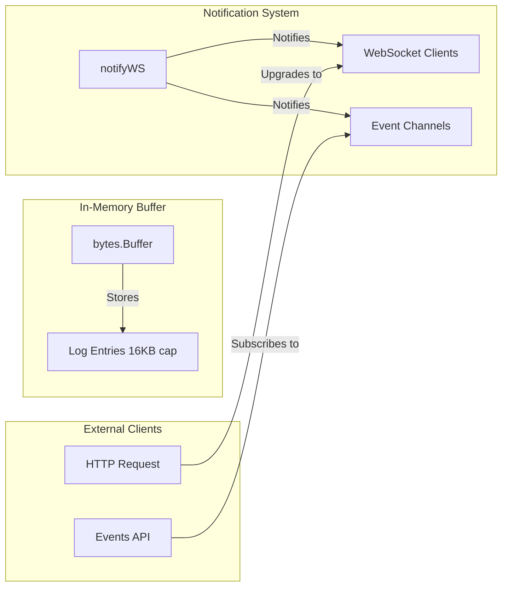
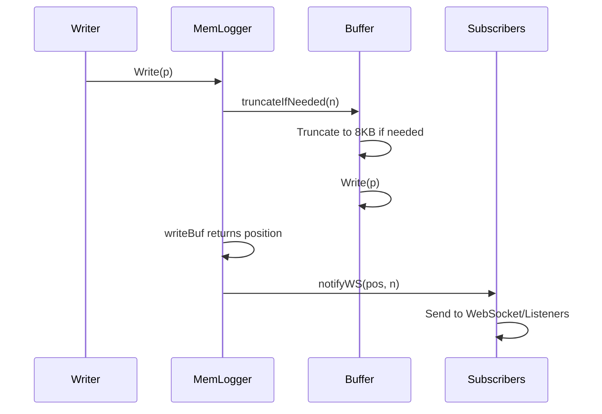

# In-Memory Logger

Provides a thread-safe in-memory circular buffer logger with WebSocket-based real-time streaming for log data.

## Overview

The memlogger package implements a thread-safe in-memory log buffer with WebSocket streaming capabilities. It stores log data in memory and pushes new entries to connected WebSocket clients and event subscribers.

### Primary Consumers

- `internal/api/v1/cert/renew` - Provides WebSocket endpoint for certificate renewal logs
- Diagnostic and debugging interfaces

### Non-goals

- Does not persist logs to disk
- Does not provide log rotation or retention policies
- Does not support structured/log levels
- Does not provide authentication for WebSocket connections

### Stability

Internal package. Public interfaces are stable.

## Public API

### Exported Types

#### MemLogger Interface

```go
type MemLogger io.Writer
```

The `MemLogger` is an `io.Writer` interface. Any data written to it is stored in the circular buffer and broadcast to subscribers.

### Exported Functions

#### GetMemLogger

```go
func GetMemLogger() MemLogger
```

Returns the global singleton `MemLogger` instance.

**Example:**

```go
logger := memlogger.GetMemLogger()
logger.Write([]byte("log message"))
```

#### HandlerFunc

```go
func HandlerFunc() gin.HandlerFunc
```

Returns a Gin middleware handler that upgrades HTTP connections to WebSocket and streams log data.

**Example:**

```go
router.GET("/logs/ws", memlogger.HandlerFunc())
```

#### Events

```go
func Events() (<-chan []byte, func())
```

Returns a channel for receiving log events and a cancel function to unsubscribe.

**Returns:**

- `<-chan []byte` - Channel receiving log entry slices
- `func()` - Cleanup function that unsubscribes and closes the channel

**Example:**

```go
ch, cancel := memlogger.Events()
defer cancel()

for event := range ch {
    fmt.Println(string(event))
}
```

## Architecture

### Core Components



| Component      | Responsibility                                   |
| -------------- | ------------------------------------------------ |
| `memLogger`    | Main struct holding buffer and subscription maps |
| `bytes.Buffer` | Circular buffer for log storage (16KB max)       |
| `connChans`    | xsync.Map of WebSocket channels                  |
| `listeners`    | xsync.Map of event channels                      |

### Write Flow



### Buffer Behavior

The circular buffer has fixed maximum size:

| Property           | Value      |
| ------------------ | ---------- |
| Maximum Size       | 16 KB      |
| Truncate Threshold | 8 KB (50%) |
| Write Chunk Size   | 4 KB       |
| Write Timeout      | 10 seconds |

**Truncation Logic:**
When the buffer exceeds the maximum size:

1. The buffer is truncated to 8 KB (half the maximum)
1. Oldest entries are removed first
1. Recent logs are always preserved

### Thread Safety

Multiple synchronization mechanisms ensure thread safety:

| Field        | Mutex Type     | Purpose                               |
| ------------ | -------------- | ------------------------------------- |
| `Buffer`     | `sync.RWMutex` | Protecting buffer operations          |
| `notifyLock` | `sync.RWMutex` | Protecting notification maps          |
| `connChans`  | `xsync.Map`    | Thread-safe WebSocket channel storage |
| `listeners`  | `xsync.Map`    | Thread-safe event listener storage    |

## Configuration Surface

No explicit configuration. The singleton instance uses fixed constants:

```go
const (
    maxMemLogSize         = 16 * 1024  // 16KB buffer
    truncateSize          = maxMemLogSize / 2  // 8KB
    initialWriteChunkSize = 4 * 1024
    writeTimeout          = 10 * time.Second
)
```

## Dependency and Integration Map

### Internal Dependencies

| Dependency                                 | Purpose              |
| ------------------------------------------ | -------------------- |
| `github.com/yusing/goutils/http/websocket` | WebSocket management |

### External Dependencies

| Dependency                      | Purpose                   |
| ------------------------------- | ------------------------- |
| `github.com/gin-gonic/gin`      | HTTP/WebSocket handling   |
| `github.com/puzpuzpuz/xsync/v4` | Concurrent map operations |

## Observability

### Logs

No logging in this package. Errors are returned via WebSocket write failures.

### Metrics

None exposed.

## Failure Modes and Recovery

| Failure                 | Detection                | Recovery                  |
| ----------------------- | ------------------------ | ------------------------- |
| WebSocket write timeout | 3-second timer           | Skip subscriber, continue |
| Buffer write error      | `writeBuf` returns error | Logged but not returned   |
| Subscriber channel full | Channel send timeout     | Skip subscriber, continue |
| Buffer exceeds max size | `truncateIfNeeded`       | Truncate to 8KB           |

### Concurrency Guarantees

- Multiple goroutines can write concurrently
- Multiple WebSocket connections supported
- Subscriptions can be added/removed during operation
- Buffer truncation is atomic

## Usage Examples

### Basic Log Writing

```go
import "github.com/yusing/godoxy/internal/logging/memlogger"

logger := memlogger.GetMemLogger()

// Write a simple message
logger.Write([]byte("Application started\n"))

// Write formatted logs
logger.Write([]byte(fmt.Sprintf("[INFO] Request received: %s\n", path)))
```

### WebSocket Endpoint

```go
import (
    "github.com/gin-gonic/gin"
    "github.com/yusing/godoxy/internal/logging/memlogger"
)

func setupRouter(r *gin.Engine) {
    // Real-time log streaming via WebSocket
    r.GET("/api/logs/stream", memlogger.HandlerFunc())
}
```

### Subscribing to Log Events

```go
func monitorLogs(ctx context.Context) {
    ch, cancel := memlogger.Events()
    defer cancel()

    for {
        select {
        case <-ctx.Done():
            return
        case event := <-ch:
            processLogEvent(event)
        }
    }
}

func processLogEvent(event []byte) {
    // Handle the log event
    fmt.Printf("Log: %s", string(event))
}
```

### WebSocket Client

```javascript
// Client-side JavaScript
const ws = new WebSocket("ws://localhost:8080/api/logs/stream");

ws.onmessage = (event) => {
  console.log("New log entry:", event.data);
};

ws.onclose = () => {
  console.log("Log stream disconnected");
};

ws.onerror = (error) => {
  console.error("Log stream error:", error);
};
```

### Complete Integration

```go
func setupLogging(r *gin.Engine) *memlogger.MemLogger {
    logger := memlogger.GetMemLogger()

    // WebSocket endpoint for real-time logs
    r.GET("/ws/logs", memlogger.HandlerFunc())

    return logger
}

// Elsewhere in the application
func recordRequest(logger memlogger.MemLogger, path string, status int) {
    logger.Write([]byte(fmt.Sprintf("[%s] %s - %d\n",
        time.Now().Format(time.RFC3339), path, status)))
}
```

## Performance Characteristics

- O(1) write operations (amortized)
- O(n) for truncation where n is buffer size
- WebSocket notifications are non-blocking (3-second timeout)
- Memory usage is bounded at 16KB

## Testing Notes

- Mock by providing a custom `io.Writer` implementation
- Test concurrent writes with goroutines
- Verify truncation behavior
- Test WebSocket upgrade failures

## Related Packages

- `internal/api` - HTTP API endpoints
- `github.com/gin-gonic/gin` - HTTP framework
- `github.com/yusing/goutils/http/websocket` - WebSocket utilities
