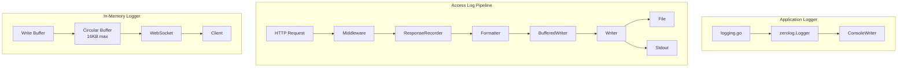

# Logging Package

Structured logging capabilities for GoDoxy, including application logging, HTTP access logging, and in-memory log streaming.

## Overview

This package provides structured logging for GoDoxy with three distinct subsystems:

- **Application Logger**: Zerolog-based console logger with level-aware formatting
- **Access Logger**: HTTP request/response logging with configurable formats, filters, and destinations
- **In-Memory Logger**: Circular buffer with WebSocket streaming for real-time log viewing

### Primary Consumers

- `internal/api/` - HTTP request logging
- `internal/route/` - Route-level access logging
- WebUI - Real-time log streaming via WebSocket

### Non-goals

- Log aggregation across multiple GoDoxy instances
- Persistent storage of application logs (access logs only)
- Structured logging output to external systems (Datadog, etc.)

### Stability

Internal package with stable APIs. Exported interfaces (`AccessLogger`, `MemLogger`) are stable.

## Packages

### `accesslog/`

HTTP request/response logging with configurable formats, filters, and destinations.

See [accesslog/README.md](./accesslog/README.md) for full documentation.

### `memlogger/`

In-memory circular buffer with WebSocket streaming for real-time log viewing.

See [memlogger/README.md](./memlogger/README.md) for full documentation.

## Architecture

## Configuration Surface

### Access Log Configuration

See [accesslog/README.md](./accesslog/README.md) for configuration options.

### In-Memory Logger

See [memlogger/README.md](./memlogger/README.md) for configuration options.

## Dependency and Integration Map

### Internal Dependencies

- `internal/task/task.go` - Lifetime management
- `internal/maxmind/` - IP geolocation for ACL logging
- `pkg/gperr` - Error handling

### External Dependencies

- `github.com/rs/zerolog` - Structured logging
- `github.com/puzpuzpuz/xsync/v4` - Concurrent maps
- `golang.org/x/time/rate` - Error rate limiting

## Observability

### Logs

| Level   | When                                     |
| ------- | ---------------------------------------- |
| `Debug` | Buffer size adjustments, rotation checks |
| `Info`  | Log rotation events, file opens/closes   |
| `Error` | Write failures (rate-limited)            |

## Failure Modes and Recovery

| Failure Mode                | Impact                   | Recovery                                                    |
| --------------------------- | ------------------------ | ----------------------------------------------------------- |
| File write failure          | Log entries dropped      | Rate-limited error logging; task termination after 5 errors |
| Disk full                   | Rotation fails           | Continue logging until space available                      |
| WebSocket client disconnect | Client misses logs       | Client reconnects to receive new logs                       |
| Buffer overflow (memlogger) | Oldest entries truncated | Automatic truncation at 50% threshold                       |

## Testing Notes

- `access_logger_test.go` - Integration tests with mock file system
- `file_logger_test.go` - Reference counting tests
- `back_scanner_test.go` - Rotation boundary tests
