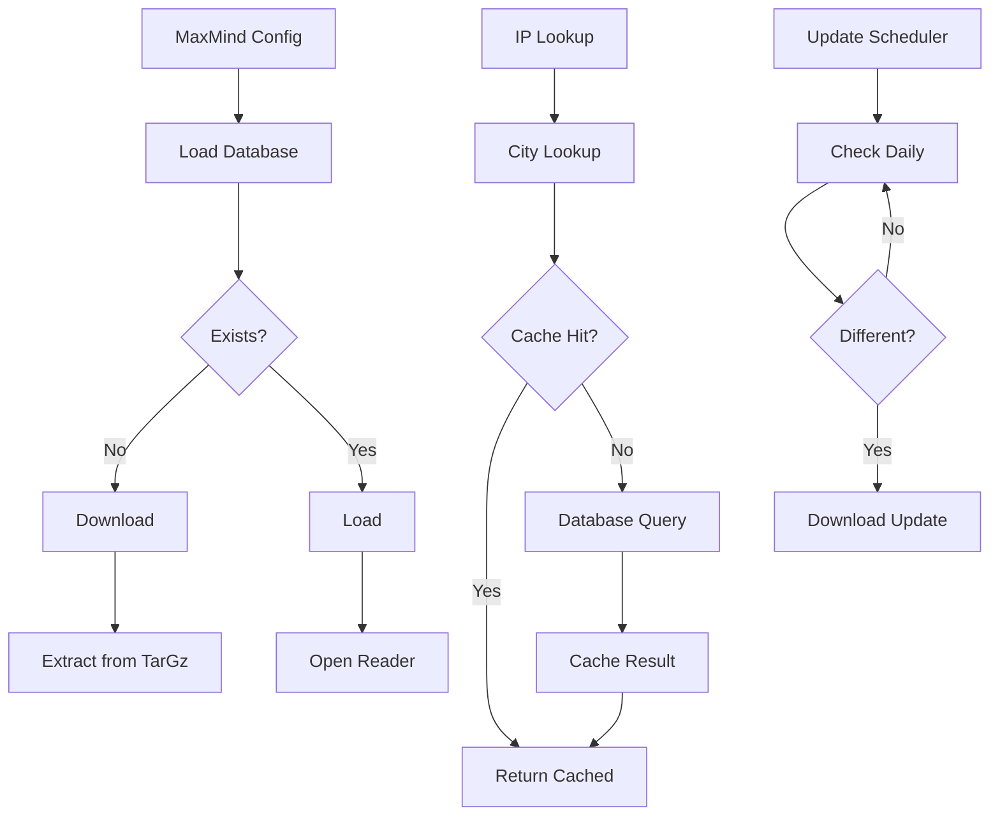
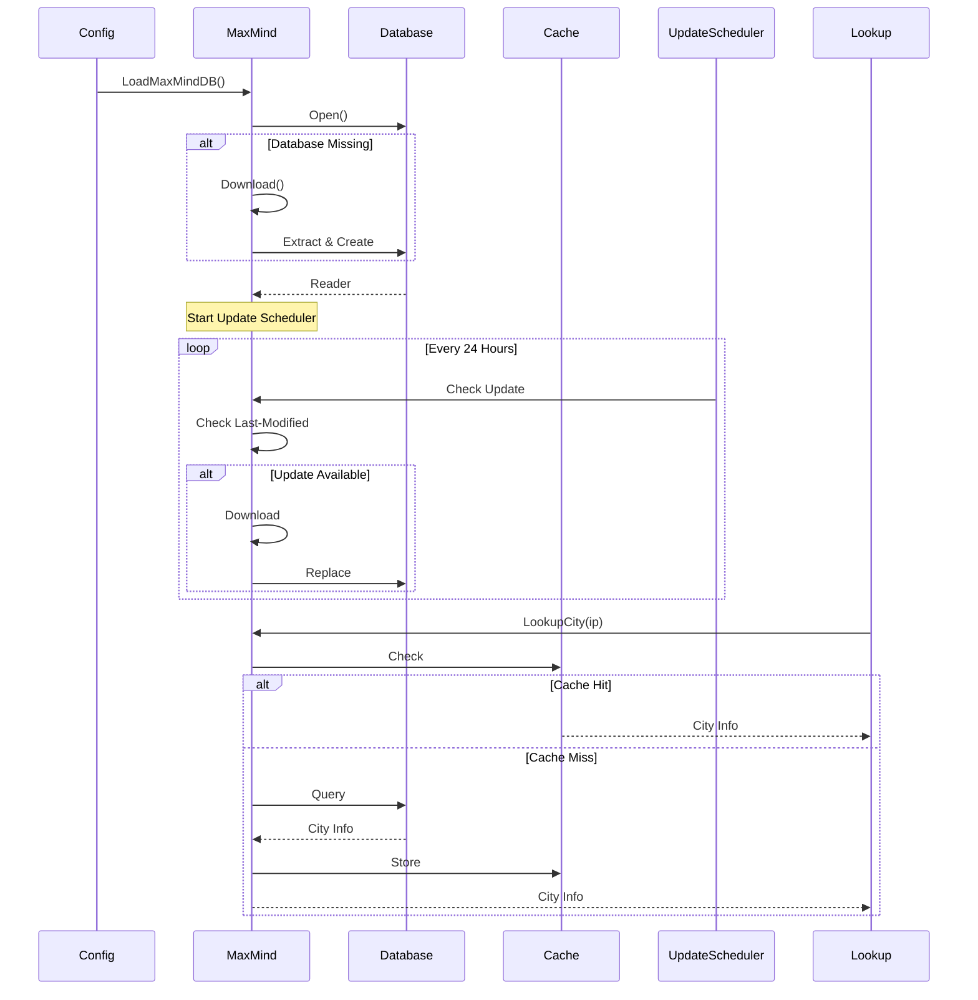

# MaxMind

The maxmind package provides MaxMind GeoIP database integration for IP geolocation, including automatic database downloading and updates.

## Overview

The maxmind package implements MaxMind GeoIP database management, providing IP geolocation lookups for country and city information. It supports automatic database downloading, scheduled updates, and thread-safe access.

### Key Features

- MaxMind GeoIP database loading
- Automatic database downloading from MaxMind
- Scheduled updates every 24 hours
- City lookup with cache support
- IP geolocation (country, city, timezone)
- Thread-safe access

## Architecture



## Core Components

### MaxMind Structure

```go
type MaxMind struct {
    *Config
    lastUpdate time.Time
    db         struct {
        *maxminddb.Reader
        sync.RWMutex
    }
}
```

### Configuration

```go
type Config struct {
    Database   string  // Database type (GeoLite2 or GeoIP2)
    AccountID  int
    LicenseKey Secret
}
```

### IP Information

```go
type IPInfo struct {
    IP          net.IP
    Str         string
    Country     *Country
    City        *City
    Location    *Location
}

type Country struct {
    IsoCode string
    Name    string
}

type City struct {
    Country   *Country
    Name      string
    Location  *Location
}

type Location struct {
    TimeZone string
    Latitude float64
    Longitude float64
}
```

## Public API

### Initialization

```go
// LoadMaxMindDB loads or downloads the MaxMind database.
func (cfg *MaxMind) LoadMaxMindDB(parent task.Parent) error
```

### Lookup

```go
// LookupCity looks up city information for an IP.
func LookupCity(info *IPInfo) (city *City, ok bool)
```

## Usage

### Basic Setup

```go
maxmindCfg := &maxmind.Config{
    Database:   maxmind.MaxMindGeoLite,
    AccountID:  123456,
    LicenseKey: "your-license-key",
}

err := maxmindCfg.LoadMaxMindDB(parent)
if err != nil {
    log.Fatal(err)
}
```

### IP Lookup

```go
// Create IP info
ipInfo := &maxmind.IPInfo{
    IP:  net.ParseIP("8.8.8.8"),
    Str: "8.8.8.8",
}

// Lookup city
city, ok := maxmind.LookupCity(ipInfo)
if ok {
    fmt.Printf("Country: %s\n", city.Country.IsoCode)
    fmt.Printf("City: %s\n", city.Name)
    fmt.Printf("Timezone: %s\n", city.Location.TimeZone)
}
```

### Database Types

```go
const (
    MaxMindGeoLite = "GeoLite2-Country"
    MaxMindGeoIP2  = "GeoIP2-Country"
)
```

## Data Flow



## Database Download

### Download Process

```go
func (cfg *MaxMind) download() error {
    resp, err := cfg.doReq(http.MethodGet)
    if err != nil {
        return err
    }

    // Read response
    databaseGZ, err := io.ReadAll(resp.Body)
    if err != nil {
        return err
    }

    // Extract from tar.gz
    err = extractFileFromTarGz(databaseGZ, cfg.dbFilename(), tmpDBPath)
    if err != nil {
        return err
    }

    // Validate
    db, err := maxmindDBOpen(tmpDBPath)
    if err != nil {
        os.Remove(tmpDBPath)
        return err
    }
    db.Close()

    // Rename to final location
    os.Rename(tmpDBPath, dbFile)
    return nil
}
```

### Security Checks

The download process includes tar bomb protection:

```go
sumSize := int64(0)
for {
    hdr, err := tr.Next()
    if err == io.EOF {
        break
    }
    sumSize += hdr.Size
    if sumSize > 30*1024*1024 {
        return errors.New("file size exceeds 30MB")
    }
}
```

## Update Scheduling

```go
func (cfg *MaxMind) scheduleUpdate(parent task.Parent) {
    task := parent.Subtask("maxmind_schedule_update", true)
    ticker := time.NewTicker(updateInterval) // 24 hours

    cfg.loadLastUpdate()
    cfg.update()

    for {
        select {
        case <-task.Context().Done():
            return
        case <-ticker.C:
            cfg.update()
        }
    }
}
```

## Thread Safety

The database uses a read-write mutex:

```go
type MaxMind struct {
    *Config
    db struct {
        *maxminddb.Reader
        sync.RWMutex
    }
}

// Lookups use RLock
func (cfg *MaxMind) lookup(ip net.IP) (*maxminddb.City, error) {
    cfg.db.RLock()
    defer cfg.db.RUnlock()
    return cfg.db.Lookup(ip)
}
```

## Configuration

### Environment Variables

| Variable              | Description         |
| --------------------- | ------------------- |
| `MAXMIND_ACCOUNT_ID`  | MaxMind account ID  |
| `MAXMIND_LICENSE_KEY` | MaxMind license key |

### YAML Configuration

```yaml
providers:
  maxmind:
    database: geolite2
    account_id: 123456
    license_key: your-license-key
```

## Integration Points

The maxmind package integrates with:

- **ACL**: IP-based access control (country/timezone matching)
- **Config**: Configuration management
- **Logging**: Update notifications
- **City Cache**: IP geolocation caching

## Error Handling

```go
var (
    ErrResponseNotOK   = errors.New("response not OK")
    ErrDownloadFailure = errors.New("download failure")
)
```

## Performance Considerations

- 24-hour update interval reduces unnecessary downloads
- Database size ~10-30MB
- City lookup cache reduces database queries
- RLock for concurrent reads
