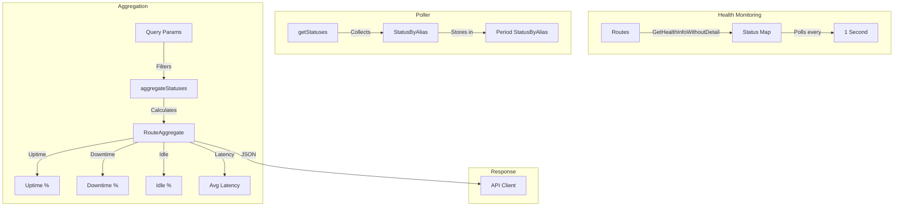
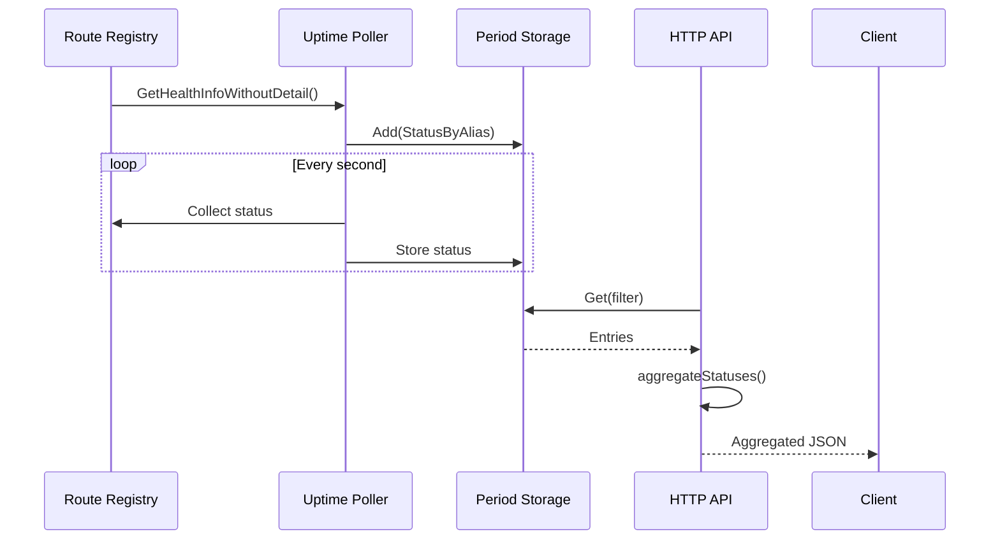

# Uptime

Tracks and aggregates route health status over time, providing uptime/downtime statistics and latency metrics.

## Overview

The uptime package monitors route health status and calculates uptime percentages over configurable time periods. It integrates with the `period` package for historical storage and provides aggregated statistics for visualization.

### Primary Consumers

- `internal/api/v1/metrics` - HTTP endpoint for uptime data
- `internal/homepage` - Dashboard uptime widgets
- Monitoring and alerting systems

### Non-goals

- Does not perform health checks (handled by `internal/route/routes`)
- Does not provide alerting on downtime
- Does not persist data beyond the period package retention
- Does not aggregate across multiple GoDoxy instances

### Stability

Internal package. Data format and API are stable.

## Public API

### Exported Types

#### StatusByAlias

```go
type StatusByAlias struct {
    Map       map[string]routes.HealthInfoWithoutDetail `json:"statuses"`
    Timestamp int64                                     `json:"timestamp"`
}
```

Container for health status of all routes at a specific time.

#### Status

```go
type Status struct {
    Status    types.HealthStatus `json:"status" swaggertype:"string" enums:"healthy,unhealthy,unknown,napping,starting"`
    Latency   int32              `json:"latency"`
    Timestamp int64              `json:"timestamp"`
}
```

Individual route status at a point in time.

#### RouteAggregate

```go
type RouteAggregate struct {
    Alias         string             `json:"alias"`
    Uptime        float32            `json:"uptime"`
    Downtime      float32            `json:"downtime"`
    Idle          float32            `json:"idle"`
    AvgLatency    float32            `json:"avg_latency"`
    CurrentStatus types.HealthStatus `json:"current_status" swaggertype:"string" enums:"healthy,unhealthy,unknown,napping,starting"`
    Statuses      []Status           `json:"statuses"`
}
```

Aggregated statistics for a single route.

#### Aggregated

```go
type Aggregated []RouteAggregate
```

Slice of route aggregates, sorted alphabetically by alias.

### Exported Variables

#### Poller

```go
var Poller = period.NewPoller("uptime", getStatuses, aggregateStatuses)
```

Pre-configured poller for uptime metrics. Start with `Poller.Start()`.

### Unexported Functions

#### getStatuses

```go
func getStatuses(ctx context.Context, _ StatusByAlias) (StatusByAlias, error)
```

Collects current status of all routes. Called by the period poller every second.

**Returns:**

- `StatusByAlias` - Map of all route statuses with current timestamp
- `error` - Always nil (errors are logged internally)

#### aggregateStatuses

```go
func aggregateStatuses(entries []StatusByAlias, query url.Values) (int, Aggregated)
```

Aggregates status entries into route statistics.

**Query Parameters:**

- `period` - Time filter (5m, 15m, 1h, 1d, 1mo)
- `limit` - Maximum number of routes to return (0 = all)
- `offset` - Offset for pagination
- `keyword` - Fuzzy search keyword for filtering routes

**Returns:**

- `int` - Total number of routes matching the query
- `Aggregated` - Slice of route aggregates

## Architecture

### Core Components



### Data Flow



### Status Types

| Status      | Description                    | Counted as Uptime? |
| ----------- | ------------------------------ | ------------------ |
| `healthy`   | Route is responding normally   | Yes                |
| `unhealthy` | Route is not responding        | No                 |
| `unknown`   | Status could not be determined | Excluded           |
| `napping`   | Route is in idle/sleep state   | Idle (separate)    |
| `starting`  | Route is starting up           | Idle (separate)    |

### Calculation Formula

For a set of status entries:

```
Uptime = healthy_count / total_count
Downtime = unhealthy_count / total_count
Idle = (napping_count + starting_count) / total_count
AvgLatency = sum(latency) / count
```

Note: `unknown` statuses are excluded from all calculations.

## Configuration Surface

No explicit configuration. The poller uses period package defaults:

| Parameter     | Value                        |
| ------------- | ---------------------------- |
| Poll Interval | 1 second                     |
| Retention     | 5m, 15m, 1h, 1d, 1mo periods |

## Dependency and Integration Map

### Internal Dependencies

| Package                   | Purpose               |
| ------------------------- | --------------------- |
| `internal/route/routes`   | Health info retrieval |
| `internal/metrics/period` | Time-bucketed storage |
| `internal/types`          | HealthStatus enum     |
| `internal/metrics/utils`  | Query utilities       |

### External Dependencies

| Dependency                               | Purpose          |
| ---------------------------------------- | ---------------- |
| `github.com/lithammer/fuzzysearch/fuzzy` | Keyword matching |
| `github.com/bytedance/sonic`             | JSON marshaling  |

### Integration Points

- Route health monitors provide status via `routes.GetHealthInfoWithoutDetail()`
- Period poller handles data collection and storage
- HTTP API provides query interface via `Poller.ServeHTTP`

## Observability

### Logs

Poller lifecycle and errors are logged via zerolog.

### Metrics

No metrics exposed directly. Status data available via API.

## Failure Modes and Recovery

| Failure                          | Detection                         | Recovery                       |
| -------------------------------- | --------------------------------- | ------------------------------ |
| Route health monitor unavailable | Empty map returned                | Log warning, continue          |
| Invalid query parameters         | `aggregateStatuses` returns empty | Return empty result            |
| Poller panic                     | Goroutine crash                   | Process terminates             |
| Persistence failure              | Load/save error                   | Log, continue with empty state |

### Fuzzy Search

The package uses `fuzzy.MatchFold` for keyword matching:

- Case-insensitive matching
- Substring matching
- Fuzzy ranking

## Usage Examples

### Starting the Poller

```go
import "github.com/yusing/godoxy/internal/metrics/uptime"

func init() {
    uptime.Poller.Start()
}
```

### HTTP Endpoint

```go
import (
    "github.com/gin-gonic/gin"
    "github.com/yusing/godoxy/internal/metrics/uptime"
)

func setupUptimeAPI(r *gin.Engine) {
    r.GET("/api/uptime", uptime.Poller.ServeHTTP)
}
```

**API Examples:**

```bash
# Get latest status
curl http://localhost:8080/api/uptime

# Get 1-hour history
curl "http://localhost:8080/api/uptime?period=1h"

# Get with limit and offset (pagination)
curl "http://localhost:8080/api/uptime?limit=10&offset=0"

# Search for routes containing "api"
curl "http://localhost:8080/api/uptime?keyword=api"

# Combined query
curl "http://localhost:8080/api/uptime?period=1d&limit=20&offset=0&keyword=docker"
```

### WebSocket Streaming

```javascript
const ws = new WebSocket(
  "ws://localhost:8080/api/uptime?period=1m&interval=5s",
);

ws.onmessage = (event) => {
  const data = JSON.parse(event.data);
  data.data.forEach((route) => {
    console.log(`${route.alias}: ${route.uptime * 100}% uptime`);
  });
};
```

### Direct Data Access

```go
// Get entries for the last hour
entries, ok := uptime.Poller.Get(period.MetricsPeriod1h)
for _, entry := range entries {
    for alias, status := range entry.Map {
        fmt.Printf("Route %s: %s (latency: %dms)\n",
            alias, status.Status, status.Latency.Milliseconds())
    }
}

// Get aggregated statistics
_, agg := uptime.aggregateStatuses(entries, url.Values{
    "period": []string{"1h"},
})

for _, route := range agg {
    fmt.Printf("%s: %.1f%% uptime, %.1fms avg latency\n",
        route.Alias, route.Uptime*100, route.AvgLatency)
}
```

### Response Format

**Latest Status Response:**

```json
{
  "alias1": {
    "status": "healthy",
    "latency": 45
  },
  "alias2": {
    "status": "unhealthy",
    "latency": 0
  }
}
```

**Aggregated Response:**

```json
{
  "total": 5,
  "data": [
    {
      "alias": "api-server",
      "uptime": 0.98,
      "downtime": 0.02,
      "idle": 0.0,
      "avg_latency": 45.5,
      "current_status": "healthy",
      "statuses": [
        { "status": "healthy", "latency": 45, "timestamp": 1704892800 }
      ]
    }
  ]
}
```

## Performance Characteristics

- O(n) status collection per poll where n = number of routes
- O(m \* k) aggregation where m = entries, k = routes
- Memory: O(p _ r _ s) where p = periods, r = routes, s = status size
- Fuzzy search is O(routes \* keyword_length)

## Testing Notes

- Mock `routes.GetHealthInfoWithoutDetail()` for testing
- Test aggregation with known status sequences
- Verify pagination and filtering logic
- Test fuzzy search matching

## Related Packages

- `internal/route/routes` - Route health monitoring
- `internal/metrics/period` - Time-bucketed metrics storage
- `internal/types` - Health status types
