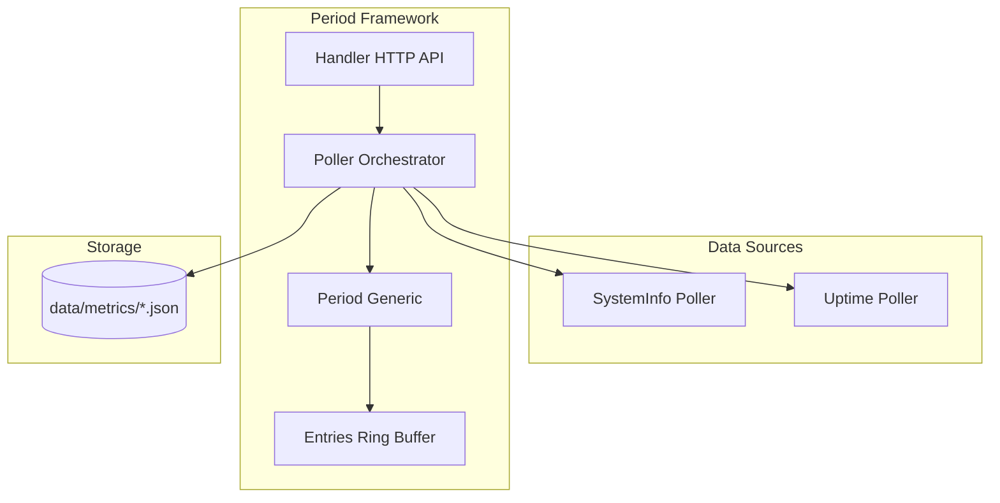

# Metrics Package

System monitoring and metrics collection for GoDoxy with time-series storage and REST/WebSocket APIs.

## Overview

This package provides a unified metrics collection system that:

- Polls system and route data at regular intervals
- Stores historical data across multiple time periods
- Exposes both REST and WebSocket APIs for consumption

### Primary Consumers

- `internal/api/v1/metrics/` - REST API endpoints
- WebUI - Real-time charts
- `internal/metrics/uptime/` - Route health monitoring

### Non-goals

- Metric aggregation from external sources
- Alerting (handled by `internal/notif/`)
- Long-term storage (30-day retention only)

### Stability

Internal package. See `internal/metrics/period/README.md` for the core framework documentation.

## Packages

### `period/`

Generic time-bucketed metrics storage framework with:

- `Period[T]` - Multi-timeframe container
- `Poller[T, A]` - Background data collector
- `Entries[T]` - Circular buffer for time-series data

See [period/README.md](./period/README.md) for full documentation.

### `uptime/`

Route health status monitoring using the period framework.

### `systeminfo/`

System metrics collection (CPU, memory, disk, network, sensors) using the period framework.

## Architecture

## Configuration Surface

No explicit configuration. Pollers respect `common.MetricsDisable*` flags:

| Flag                    | Disables                  |
| ----------------------- | ------------------------- |
| `MetricsDisableCPU`     | CPU percentage collection |
| `MetricsDisableMemory`  | Memory statistics         |
| `MetricsDisableDisk`    | Disk usage and I/O        |
| `MetricsDisableNetwork` | Network counters          |
| `MetricsDisableSensors` | Temperature sensors       |

## Dependency and Integration Map

### Internal Dependencies

- `github.com/yusing/goutils/task` - Lifetime management
- `internal/types` - Health check types

### External Dependencies

- `github.com/shirou/gopsutil/v4` - System metrics collection
- `github.com/puzpuzpuz/xsync/v4` - Atomic value storage
- `github.com/bytedance/sonic` - JSON serialization

## Observability

### Logs

| Level   | When                                        |
| ------- | ------------------------------------------- |
| `Debug` | Poller start, data load/save                |
| `Error` | Data source failures (aggregated every 30s) |

## Failure Modes and Recovery

| Failure Mode              | Impact               | Recovery                         |
| ------------------------- | -------------------- | -------------------------------- |
| Data source timeout       | Missing data point   | Logged, aggregated, continues    |
| Disk read failure         | No historical data   | Starts fresh, warns              |
| Disk write failure        | Data loss on restart | Continues, retries next interval |
| Memory allocation failure | OOM risk             | Go runtime handles               |
