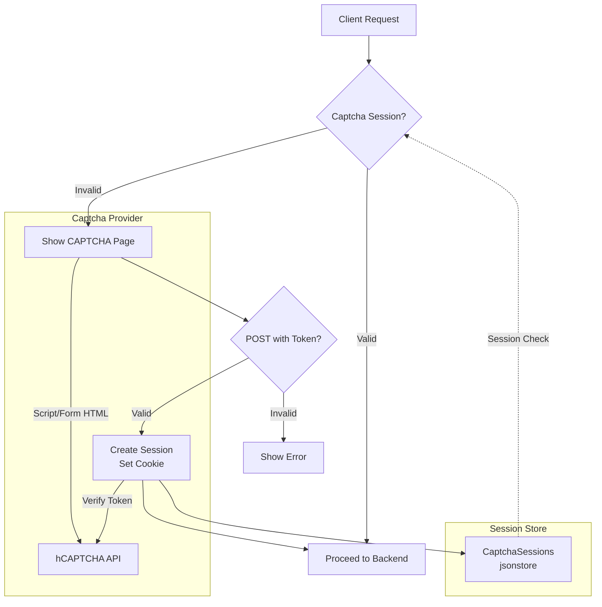
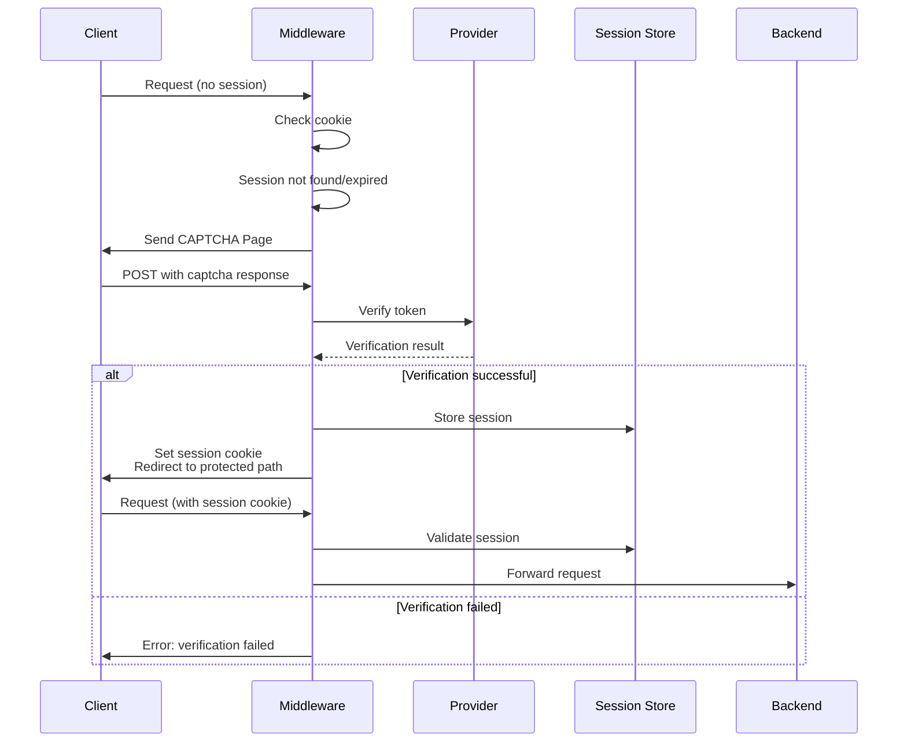
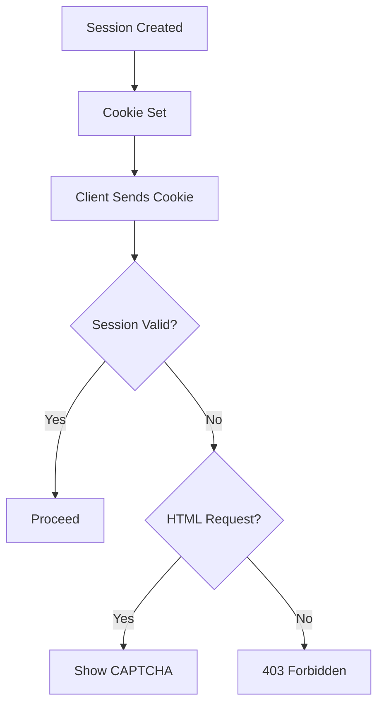

# Captcha Middleware

CAPTCHA verification middleware package providing session-based captcha challenge and verification.

## Overview

This package implements CAPTCHA verification middleware that protects routes by requiring users to complete a CAPTCHA challenge before accessing the protected resource. It supports pluggable providers (currently hCAPTCHA) and uses encrypted sessions for verification state.

## Architecture



## Captcha Flow



## Core Components

### Provider Interface

```go
type Provider interface {
    // CSP directives for the captcha provider
    CSPDirectives() []string
    // CSP sources for the captcha provider
    CSPSources() []string
    // Verify the captcha response from the request
    Verify(r *http.Request) error
    // Session expiry duration after successful verification
    SessionExpiry() time.Duration
    // Script HTML to include in the page
    ScriptHTML() string
    // Form HTML to render the captcha widget
    FormHTML() string
}
```

### ProviderBase

```go
type ProviderBase struct {
    Expiry time.Duration `json:"session_expiry"` // Default: 24 hours
}

func (p *ProviderBase) SessionExpiry() time.Duration
```

### hCAPTCHA Provider

```go
type HcaptchaProvider struct {
    ProviderBase
    SiteKey string `json:"site_key" validate:"required"`
    Secret  string `json:"secret" validate:"required"`
}

// CSP Directives: script-src, frame-src, style-src, connect-src
// CSP Sources: https://hcaptcha.com, https://*.hcaptcha.com
```

### Captcha Session

```go
type CaptchaSession struct {
    ID    string    `json:"id"`
    Expiry time.Time `json:"expiry"`
}

var CaptchaSessions = jsonstore.Store[*CaptchaSession]("captcha_sessions")

func newCaptchaSession(p Provider) *CaptchaSession
func (s *CaptchaSession) expired() bool
```

## Middleware Integration

```go
type hCaptcha struct {
    captcha.HcaptchaProvider
}

func (h *hCaptcha) before(w http.ResponseWriter, r *http.Request) bool {
    return captcha.PreRequest(h, w, r)
}

var HCaptcha = NewMiddleware[hCaptcha]()
```

### PreRequest Handler

```go
func PreRequest(p Provider, w http.ResponseWriter, r *http.Request) (proceed bool)
```

This function:

1. Checks for valid session cookie
1. Validates session expiry
1. Returns true if session is valid
1. For non-HTML requests, returns 403 Forbidden
1. For POST requests, verifies the captcha token
1. For GET requests, renders the CAPTCHA challenge page

## Configuration

### hCAPTCHA Configuration

```yaml
middleware:
  my-captcha:
    use: hcaptcha
    site_key: "YOUR_SITE_KEY"
    secret: "YOUR_SECRET"
    session_expiry: 24h # optional, default 24h
```

### Route Configuration

```yaml
routes:
  - host: example.com
    path: /admin
    middlewares:
      - my-captcha
```

## Usage Examples

### Basic Setup

```go
import "github.com/yusing/godoxy/internal/net/gphttp/middleware"

hcaptchaMiddleware := middleware.HCaptcha.New(middleware.OptionsRaw{
    "site_key": "your-site-key",
    "secret":   "your-secret",
})
```

### Using in Middleware Chain

```yaml
# config/middlewares/admin-protection.yml
- use: captcha
  site_key: "${HCAPTCHA_SITE_KEY}"
  secret: "${HCAPTCHA_SECRET}"
  bypass:
    - type: CIDR
      value: 10.0.0.0/8
```

## Session Management

Sessions are stored in a JSON-based store with the following properties:

- **Session ID**: 32-byte CRNG (`crypto/rand.Read`) random hex string
- **Expiry**: Configurable duration (default 24 hours)
- **Cookie**: `godoxy_captcha_session` with HttpOnly flag



## CSP Integration

The CAPTCHA provider supplies CSP directives that should be added to the response:

```go
// hCAPTCHA CSP Directives
CSPDirectives() []string
// Returns: ["script-src", "frame-src", "style-src", "connect-src"]

CSPSources() []string
// Returns: ["https://hcaptcha.com", "https://*.hcaptcha.com"]
```

## HTML Template

The package includes an embedded HTML template (`captcha.html`) that renders the CAPTCHA challenge page with:

- Provider script (`<script src="https://js.hcaptcha.com/1/api.js">`)
- Provider form (`<div class="h-captcha" data-sitekey="...">`)
- Auto-submit callback on successful verification

## Security Considerations

1. **Session Cookie**: Uses HttpOnly flag to prevent JavaScript access
1. **Token Verification**: Tokens are verified server-side with the CAPTCHA provider
1. **Remote IP**: Client IP is included in verification request to prevent token reuse
1. **Session Expiry**: Sessions expire after configurable duration
1. **Non-HTML Fallback**: Non-HTML requests receive 403 without challenge page

## Error Handling

```go
var ErrCaptchaVerificationFailed = gperr.New("captcha verification failed")

// Verification errors are logged with request details
log.Warn().Err(err).Str("url", r.URL.String()).Str("remote_addr", r.RemoteAddr).Msg("failed to verify captcha")
```

## Integration with GoDoxy

The captcha middleware integrates with GoDoxy's:

- **Authentication**: Sessions are managed via `auth.SetTokenCookie`
- **Session Store**: Uses `jsonstore` for persistent session storage
- **Middleware Framework**: Implements `RequestModifier` interface
