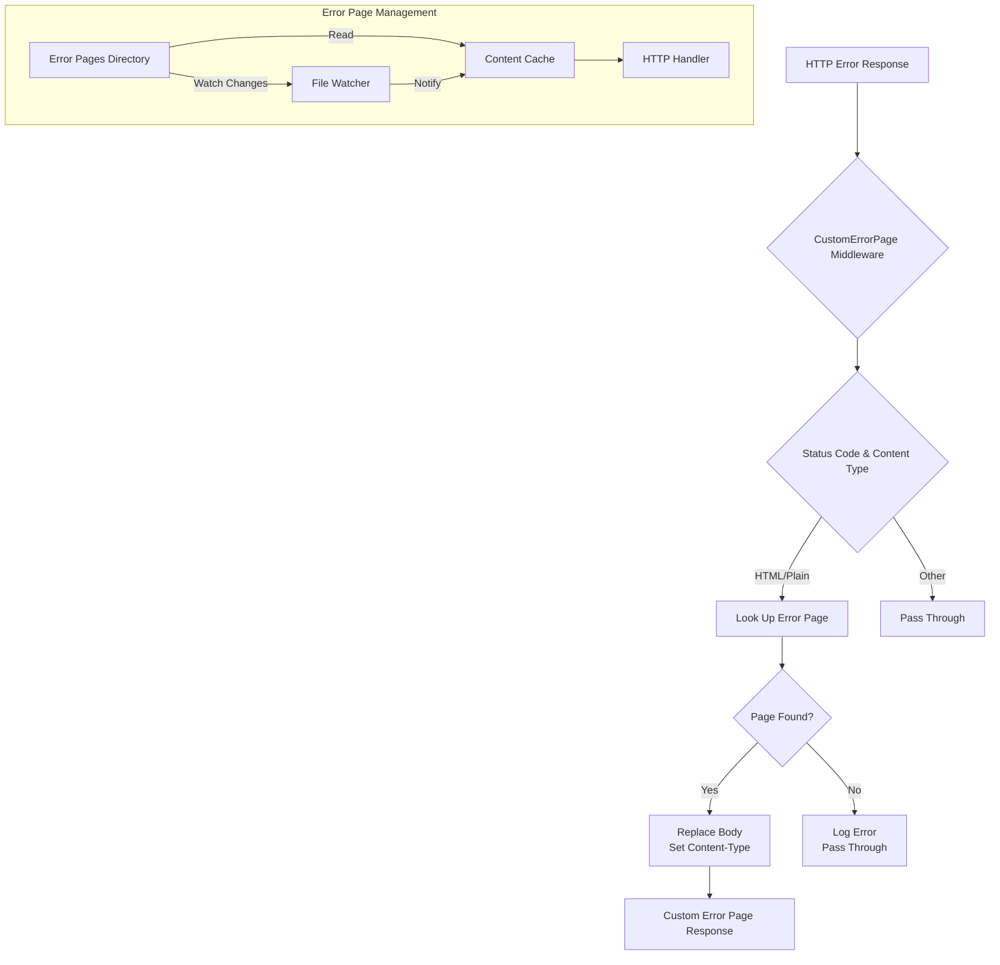
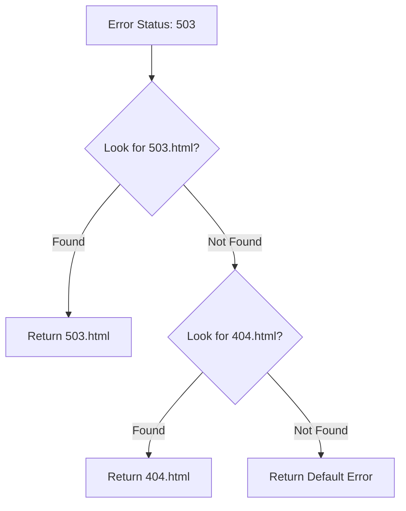
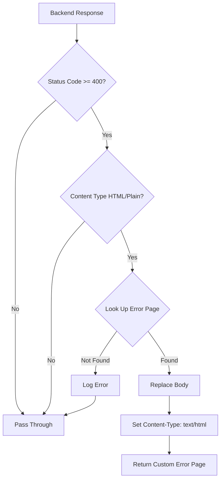

# Error Page Middleware

Custom error page serving middleware that replaces default HTTP error responses with styled custom pages.

## Overview

This package provides two components:

1. **errorpage package**: Manages error page file loading, caching, and hot-reloading from disk
1. **CustomErrorPage middleware**: Intercepts error responses and replaces them with custom error pages

## Architecture



## Error Page Lookup Flow



## Core Components

### Error Page Package

```go
var (
    setupOnce      sync.Once
    dirWatcher     watcher.Watcher
    fileContentMap = xsync.NewMap[string, []byte]()
)

func setup() {
    t := task.RootTask("error_page", false)
    dirWatcher = watcher.NewDirectoryWatcher(t, errPagesBasePath)
    loadContent()
    go watchDir()
}

// GetStaticFile retrieves an error page file by filename
func GetStaticFile(filename string) ([]byte, bool)

// GetErrorPageByStatus retrieves the error page for a given status code
func GetErrorPageByStatus(statusCode int) (content []byte, ok bool)
```

### File Watcher

The package watches the error pages directory for changes:

```go
func watchDir() {
    eventCh, errCh := dirWatcher.Events(task.RootContext())
    for {
        select {
        case event := <-eventCh:
            filename := event.ActorName
            switch event.Action {
            case events.ActionFileWritten:
                fileContentMap.Delete(filename)
                loadContent()
            case events.ActionFileDeleted:
                fileContentMap.Delete(filename)
            case events.ActionFileRenamed:
                fileContentMap.Delete(filename)
                loadContent()
            }
        case err := <-errCh:
            gperr.LogError("error watching error page directory", err)
        }
    }
}
```

### Custom Error Page Middleware

```go
type customErrorPage struct{}

var CustomErrorPage = NewMiddleware[customErrorPage]()

const StaticFilePathPrefix = "/$gperrorpage/"
```

### Request Modifier

```go
func (customErrorPage) before(w http.ResponseWriter, r *http.Request) bool {
    return !ServeStaticErrorPageFile(w, r)
}
```

### Response Modifier

```go
func (customErrorPage) modifyResponse(resp *http.Response) error {
    // Only handles:
    // - Non-success status codes (4xx, 5xx)
    // - HTML or Plain Text content types
    contentType := httputils.GetContentType(resp.Header)
    if !httputils.IsSuccess(resp.StatusCode) && (contentType.IsHTML() || contentType.IsPlainText()) {
        errorPage, ok := errorpage.GetErrorPageByStatus(resp.StatusCode)
        if ok {
            // Replace response body with error page
            resp.Body = io.NopCloser(bytes.NewReader(errorPage))
            resp.ContentLength = int64(len(errorPage))
            resp.Header.Set(httpheaders.HeaderContentLength, strconv.Itoa(len(errorPage)))
            resp.Header.Set(httpheaders.HeaderContentType, "text/html; charset=utf-8")
        }
    }
    return nil
}
```

## Static File Serving

The middleware also serves static error page assets:

```go
func ServeStaticErrorPageFile(w http.ResponseWriter, r *http.Request) bool {
    if strings.HasPrefix(path, StaticFilePathPrefix) {
        filename := path[len(StaticFilePathPrefix):]
        file, ok := errorpage.GetStaticFile(filename)
        if ok {
            // Set content type based on extension
            switch ext := filepath.Ext(filename); ext {
            case ".html":
                w.Header().Set(httpheaders.HeaderContentType, "text/html; charset=utf-8")
            case ".js":
                w.Header().Set(httpheaders.HeaderContentType, "application/javascript; charset=utf-8")
            case ".css":
                w.Header().Set(httpheaders.HeaderContentType, "text/css; charset=utf-8")
            }
            w.Write(file)
            return true
        }
    }
    return false
}
```

## Configuration

### Error Pages Directory

Default path: `config/error_pages/`

### Supported Files

| File Pattern        | Description                            |
| ------------------- | -------------------------------------- |
| `{statusCode}.html` | Specific error page (e.g., `503.html`) |
| `404.html`          | Fallback for missing specific pages    |
| `*.css`             | Stylesheets                            |
| `*.js`              | JavaScript files                       |
| `*.{png,jpg,svg}`   | Images and assets                      |

### Example Structure

```
config/error_pages/
├── 403.html
├── 404.html
├── 500.html
├── 502.html
├── 503.html
├── style.css
└── logo.png
```

### Middleware Configuration

```yaml
# In route middleware configuration
- use: errorpage
  # Optional: bypass rules
  bypass:
    - type: PathPrefix
      value: /api
```

## Response Processing



## Usage Examples

### Creating Custom Error Pages

**503.html**:

```html
<!DOCTYPE html>
<html>
<head>
    <title>Service Unavailable</title>
    <link rel="stylesheet" href="/$gperrorpage/style.css">
</head>
<body>
    <div class="error-container">
        <h1>503 - Service Unavailable</h1>
        <p>The service is temporarily unavailable. Please try again later.</p>
    </div>
</body>
</html>
```

### Using in Middleware Chain

```yaml
# config/middlewares/error-pages.yml
- use: errorpage
  bypass:
    - type: PathPrefix
      value: /api/health
```

### Programmatic Usage

```go
import (
    "github.com/yusing/godoxy/internal/net/gphttp/middleware"
    "github.com/yusing/godoxy/internal/net/gphttp/middleware/errorpage"
)

// Check if error page exists
content, ok := errorpage.GetErrorPageByStatus(503)
if ok {
    // Use error page content
}

// Serve static asset
ServeStaticErrorPageFile(w, r)
```

## Integration with GoDoxy

The error page middleware integrates with:

- **File Watching**: Uses `internal/watcher` for hot-reloading
- **Task Management**: Uses `internal/task` for lifetime management
- **Content Caching**: Uses `xsync.Map` for thread-safe caching
- **HTTP Headers**: Uses `goutils/http/httpheaders` for content type handling

## Performance Considerations

- Error page content is cached in memory after first load
- File watcher notifies on changes for cache invalidation
- Static files are served directly from cache
- Concurrent access protected by `xsync.Map`

## Error Handling

```go
// Logging on error page not found
log.Error().Msgf("unable to load error page for status %d", resp.StatusCode)

// Logging on static file not found
log.Error().Msg("unable to load resource " + filename)
```
