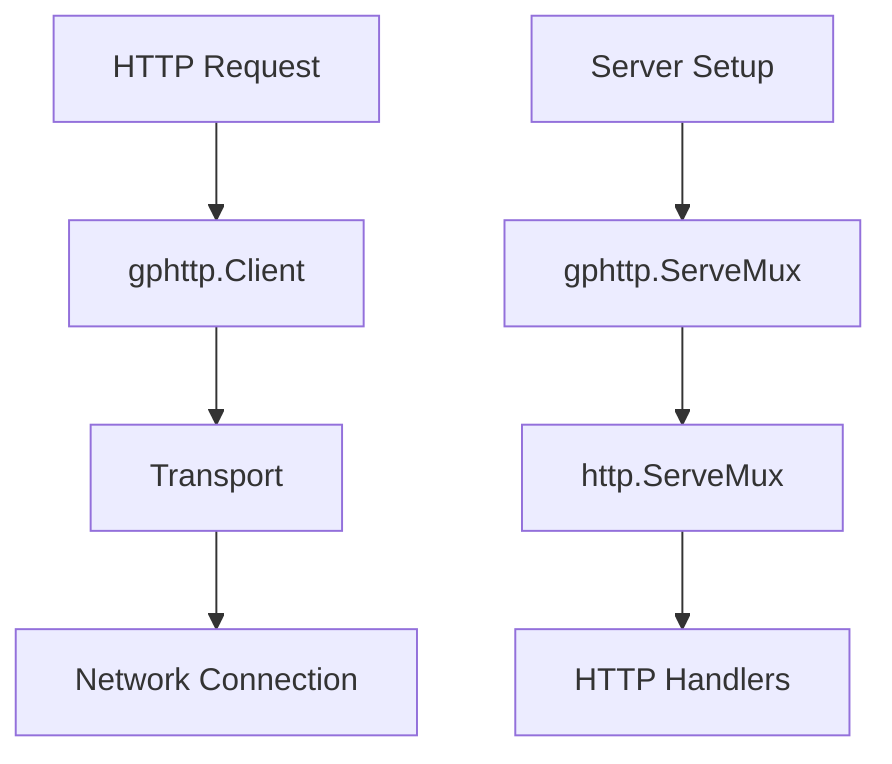

# gphttp

HTTP utilities package providing transport configuration, default HTTP client, and a wrapper around `http.ServeMux` with panic recovery.

## Overview

This package provides shared HTTP utilities used throughout GoDoxy:

- **Default HTTP Client**: Pre-configured `http.Client` with secure settings
- **Transport Factory**: Functions to create optimized `http.Transport` configurations
- **ServeMux Wrapper**: Extended `http.ServeMux` with panic recovery for handler registration

## Architecture



## Core Components

### HTTP Client

The package exports a pre-configured `http.Client` with secure defaults:

```go
var (
    httpClient = &http.Client{
        Timeout: 5 * time.Second,
        Transport: &http.Transport{
            DisableKeepAlives: true,
            ForceAttemptHTTP2: false,
            DialContext: (&net.Dialer{
                Timeout:   3 * time.Second,
                KeepAlive: 60 * time.Second,
            }).DialContext,
            TLSClientConfig: &tls.Config{InsecureSkipVerify: true},
        },
    }

    Get  = httpClient.Get
    Post = httpClient.Post
    Head = httpClient.Head
    Do   = httpClient.Do
)
```

### Transport Factory

Functions for creating optimized HTTP transports:

```go
// NewTransport creates an http.Transport with proxy support and optimized settings
func NewTransport() *http.Transport

// NewTransportWithTLSConfig creates an http.Transport with custom TLS configuration
func NewTransportWithTLSConfig(tlsConfig *tls.Config) *http.Transport
```

Default transport settings:

- `MaxIdleConnsPerHost`: 1000
- `IdleConnTimeout`: 90 seconds
- `TLSHandshakeTimeout`: 10 seconds
- `ResponseHeaderTimeout`: 60 seconds
- `WriteBufferSize` / `ReadBufferSize`: 16KB

### ServeMux Wrapper

Extended `http.ServeMux` with panic recovery:

```go
type ServeMux struct {
    *http.ServeMux
}

func NewServeMux() ServeMux
func (mux ServeMux) Handle(pattern string, handler http.Handler) (err error)
func (mux ServeMux) HandleFunc(pattern string, handler http.HandlerFunc) (err error)
```

The `Handle` and `HandleFunc` methods recover from panics and return them as errors, preventing one bad handler from crashing the entire server.

## Usage Examples

### Using the Default Client

```go
import "github.com/yusing/godoxy/internal/net/gphttp"

// Simple GET request
resp, err := gphttp.Get("https://example.com")
if err != nil {
    log.Fatal(err)
}
defer resp.Body.Close()

// POST request
resp, err := gphttp.Post("https://example.com", "application/json", body)
```

### Creating Custom Transports

```go
import (
    "crypto/tls"
    "net/http"
    "github.com/yusing/godoxy/internal/net/gphttp"
)

// Default transport with environment proxy
transport := gphttp.NewTransport()

// Custom TLS configuration
tlsConfig := &tls.Config{
    ServerName: "example.com",
}
transport := gphttp.NewTransportWithTLSConfig(tlsConfig)
```

### Using ServeMux with Panic Recovery

```go
mux := gphttp.NewServeMux()

// Register handlers - panics are converted to errors
if err := mux.HandleFunc("/api", apiHandler); err != nil {
    log.Printf("handler registration failed: %v", err)
}
```

## Integration Points

- Used by `internal/net/gphttp/middleware` for HTTP request/response processing
- Used by `internal/net/gphttp/loadbalancer` for backend connections
- Used throughout the route handling system

## Configuration

The default client disables HTTP/2 (`ForceAttemptHTTP2: false`) and keep-alives (`DisableKeepAlives: true`) for security and compatibility reasons. The transport uses environment proxy settings via `http.ProxyFromEnvironment`.
