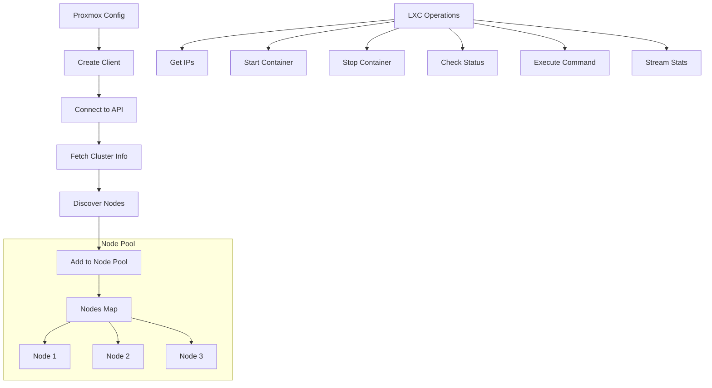
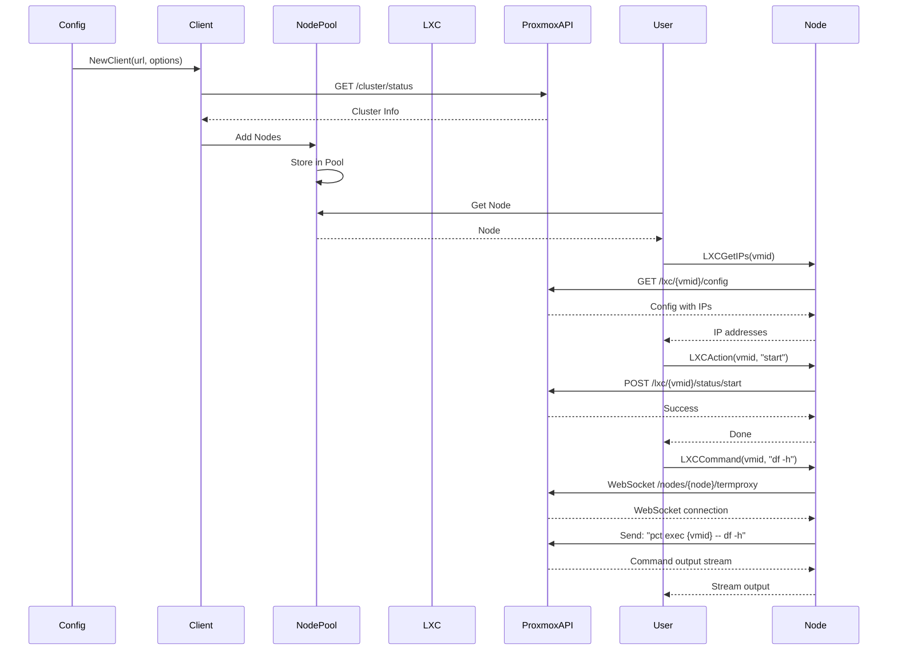

# Proxmox

The proxmox package provides Proxmox VE integration for GoDoxy, enabling management of Proxmox LXC containers.

## Overview

The proxmox package implements Proxmox API client management, node discovery, and LXC container operations including power management and IP address retrieval.

### Key Features

- Proxmox API client management
- Node discovery and pool management
- LXC container operations (start, stop, status, stats, command execution)
- IP address retrieval for containers (online and offline)
- Container stats streaming (like `docker stats`)
- Container command execution via VNC websocket
- Journalctl streaming for LXC containers
- Reverse resource lookup by IP, hostname, or alias
- Reverse node lookup by hostname, IP, or alias
- TLS configuration options
- Token and username/password authentication

## Architecture



## Core Components

### Config

```go
type Config struct {
    URL       string            `json:"url" validate:"required,url"`
    Username  string            `json:"username" validate:"required_without_all=TokenID Secret"`
    Password  strutils.Redacted `json:"password" validate:"required_without_all=TokenID Secret"`
    Realm     string            `json:"realm"`
    TokenID   string            `json:"token_id" validate:"required_without_all=Username Password"`
    Secret    strutils.Redacted `json:"secret" validate:"required_without_all=Username Password"`
    NoTLSVerify bool            `json:"no_tls_verify"`

    client *Client
}
```

### Client

```go
type Client struct {
    *proxmox.Client
    *proxmox.Cluster
    Version *proxmox.Version
    BaseURL *url.URL
    // id -> resource; id: lxc/<vmid> or qemu/<vmid>
    resources   map[string]*VMResource
    resourcesMu sync.RWMutex
}

type VMResource struct {
    *proxmox.ClusterResource
    IPs []net.IP
}

// NewClient creates a new Proxmox client.
func NewClient(baseUrl string, opts ...proxmox.Option) *Client
```

### Node

```go
type Node struct {
    name   string
    id     string
    client *Client
}

var Nodes = pool.New[*Node]("proxmox_nodes")
```

### NodeConfig

```go
type NodeConfig struct {
    Node     string   `json:"node" validate:"required"`
    VMID     *int     `json:"vmid"` // nil: auto discover; 0: node-level route; >0: lxc/qemu resource route
    VMName   string   `json:"vmname,omitempty"`
    Services []string `json:"services,omitempty" aliases:"service"`
    Files    []string `json:"files,omitempty" aliases:"file"`
}
```

## Public API

### Configuration

```go
// Init initializes the Proxmox client.
func (c *Config) Init(ctx context.Context) gperr.Error

// Client returns the Proxmox client.
func (c *Config) Client() *Client
```

### Client Operations

```go
// NewClient creates a new Proxmox client.
func NewClient(baseUrl string, opts ...proxmox.Option) *Client

// UpdateClusterInfo fetches cluster info and discovers nodes.
func (c *Client) UpdateClusterInfo(ctx context.Context) error

// UpdateResources fetches VM resources and their IP addresses.
func (c *Client) UpdateResources(ctx context.Context) error

// GetResource gets a resource by kind and id.
func (c *Client) GetResource(kind string, id int) (*VMResource, error)

// ReverseLookupResource looks up a resource by IP, hostname, or alias.
func (c *Client) ReverseLookupResource(ip net.IP, hostname string, alias string) (*VMResource, error)

// ReverseLookupNode looks up a node by hostname, IP, or alias.
func (c *Client) ReverseLookupNode(hostname string, ip net.IP, alias string) string

// NumNodes returns the number of nodes in the cluster.
func (c *Client) NumNodes() int

// Key returns the cluster ID.
func (c *Client) Key() string

// Name returns the cluster name.
func (c *Client) Name() string

// MarshalJSON returns the cluster info as JSON.
func (c *Client) MarshalJSON() ([]byte, error)
```

### Node Operations

```go
// AvailableNodeNames returns all available node names as a comma-separated string.
func AvailableNodeNames() string

// NewNode creates a new node.
func NewNode(client *Client, name, id string) *Node

// Node.Client returns the Proxmox client.
func (n *Node) Client() *Client

// Node.Get performs a GET request on the node.
func (n *Node) Get(ctx context.Context, path string, v any) error

// Node.Key returns the node name.
func (n *Node) Key() string

// Node.Name returns the node name.
func (n *Node) Name() string

// NodeCommand executes a command on the node and streams output.
func (n *Node) NodeCommand(ctx context.Context, command string) (io.ReadCloser, error)

// NodeJournalctl streams journalctl output from the node.
func (n *Node) NodeJournalctl(ctx context.Context, services []string, limit int) (io.ReadCloser, error)

// NodeTail streams tail output for the given file.
func (n *Node) NodeTail(ctx context.Context, files []string, limit int) (io.ReadCloser, error)
```

## Usage

### Basic Setup

```go
proxmoxCfg := &proxmox.Config{
    URL:         "https://proxmox.example.com:8006",
    TokenID:     "user@pam!token-name",
    Secret:      "your-api-token-secret",
    NoTLSVerify: false,
}

ctx := context.Background()
err := proxmoxCfg.Init(ctx)
if err != nil {
    log.Fatal(err)
}

client := proxmoxCfg.Client()
```

### Node Access

```go
// Get a specific node
node, ok := proxmox.Nodes.Get("pve")
if !ok {
    log.Fatal("Node not found")
}

fmt.Printf("Node: %s (%s)\n", node.Name(), node.Key())
```

### Available Nodes

```go
names := proxmox.AvailableNodeNames()
fmt.Printf("Available nodes: %s\n", names)
```

## LXC Operations

### Container Status

```go
type LXCStatus string

const (
    LXCStatusRunning   LXCStatus = "running"
    LXCStatusStopped   LXCStatus = "stopped"
    LXCStatusSuspended LXCStatus = "suspended"
)

// LXCStatus returns the current status of a container.
func (node *Node) LXCStatus(ctx context.Context, vmid int) (LXCStatus, error)

// LXCIsRunning checks if a container is running.
func (node *Node) LXCIsRunning(ctx context.Context, vmid int) (bool, error)

// LXCIsStopped checks if a container is stopped.
func (node *Node) LXCIsStopped(ctx context.Context, vmid int) (bool, error)

// LXCName returns the name of a container.
func (node *Node) LXCName(ctx context.Context, vmid int) (string, error)
```

### Container Actions

```go
type LXCAction string

const (
    LXCStart    LXCAction = "start"
    LXCShutdown LXCAction = "shutdown"
    LXCSuspend  LXCAction = "suspend"
    LXCResume   LXCAction = "resume"
    LXCReboot   LXCAction = "reboot"
)

// LXCAction performs an action on a container with task tracking.
func (node *Node) LXCAction(ctx context.Context, vmid int, action LXCAction) error

// LXCSetShutdownTimeout sets the shutdown timeout for a container.
func (node *Node) LXCSetShutdownTimeout(ctx context.Context, vmid int, timeout time.Duration) error
```

### Get Container IPs

```go
// LXCGetIPs returns IP addresses of a container.
// First tries interfaces (online), then falls back to config (offline).
func (node *Node) LXCGetIPs(ctx context.Context, vmid int) ([]net.IP, error)

// LXCGetIPsFromInterfaces returns IP addresses from network interfaces.
// Returns empty if container is stopped.
func (node *Node) LXCGetIPsFromInterfaces(ctx context.Context, vmid int) ([]net.IP, error)

// LXCGetIPsFromConfig returns IP addresses from container config.
// Works for stopped/offline containers.
func (node *Node) LXCGetIPsFromConfig(ctx context.Context, vmid int) ([]net.IP, error)
```

### Container Stats (like `docker stats`)

```go
// LXCStats streams container statistics.
// Format: "STATUS|CPU%%|MEM USAGE/LIMIT|MEM%%|NET I/O|BLOCK I/O"
// Example: "running|31.1%|9.6GiB/20GiB|48.87%|4.7GiB/3.3GiB|25GiB/36GiB"
func (node *Node) LXCStats(ctx context.Context, vmid int, stream bool) (io.ReadCloser, error)
```

### Container Command Execution

```go
// LXCCommand executes a command inside a container and streams output.
func (node *Node) LXCCommand(ctx context.Context, vmid int, command string) (io.ReadCloser, error)

// LXCJournalctl streams journalctl output for a container service.
// On non-systemd systems, it falls back to tailing /var/log/messages.
func (node *Node) LXCJournalctl(ctx context.Context, vmid int, services []string, limit int) (io.ReadCloser, error)

// LXCTail streams tail output for the given file.
func (node *Node) LXCTail(ctx context.Context, vmid int, files []string, limit int) (io.ReadCloser, error)
```

## Node Stats

```go
type NodeStats struct {
    KernelVersion string `json:"kernel_version"`
    PVEVersion    string `json:"pve_version"`
    CPUUsage      string `json:"cpu_usage"`
    CPUModel      string `json:"cpu_model"`
    MemUsage      string `json:"mem_usage"`
    MemTotal      string `json:"mem_total"`
    MemPct        string `json:"mem_pct"`
    RootFSUsage   string `json:"rootfs_usage"`
    RootFSTotal   string `json:"rootfs_total"`
    RootFSPct     string `json:"rootfs_pct"`
    Uptime        string `json:"uptime"`
    LoadAvg1m     string `json:"load_avg_1m"`
    LoadAvg5m     string `json:"load_avg_5m"`
    LoadAvg15m    string `json:"load_avg_15m"`
}

// NodeStats streams node statistics like docker stats.
func (n *Node) NodeStats(ctx context.Context, stream bool) (io.ReadCloser, error)
```

## Data Flow



## Configuration

### YAML Configuration

```yaml
providers:
  proxmox:
    - url: https://proxmox.example.com:8006
      # Token-based authentication (optional)
      token_id: user@pam!token-name
      secret: your-api-token-secret

      # Username/Password authentication (required for journalctl (service logs) streaming)
      # username: root
      # password: your-password
      # realm: pam

      no_tls_verify: false
```

### Authentication Options

```go
// Token-based authentication (recommended)
opts := []proxmox.Option{
    proxmox.WithAPIToken(c.TokenID, c.Secret.String()),
    proxmox.WithHTTPClient(&http.Client{Transport: tr}),
}

// Username/Password authentication
opts := []proxmox.Option{
    proxmox.WithCredentials(&proxmox.Credentials{
        Username: c.Username,
        Password: c.Password.String(),
        Realm:    c.Realm,
    }),
    proxmox.WithHTTPClient(&http.Client{Transport: tr}),
}
```

### TLS Configuration

```go
// With TLS verification (default)
tr := gphttp.NewTransport()

// Without TLS verification (insecure)
tr := gphttp.NewTransportWithTLSConfig(&tls.Config{
    InsecureSkipVerify: true,
})
```

## Node Pool

The package maintains a global node pool:

```go
var Nodes = pool.New[*Node]("proxmox_nodes")
```

### Pool Operations

```go
// Add a node
Nodes.Add(&Node{name: "pve1", id: "node/pve1", client: client})

// Get a node
node, ok := Nodes.Get("pve1")

// Iterate nodes
for _, node := range Nodes.Iter {
    fmt.Printf("Node: %s\n", node.Name())
}
```

## Integration with Route

The proxmox package integrates with the route package for idlewatcher:

```go
// In route validation
if r.Idlewatcher != nil && r.Idlewatcher.Proxmox != nil {
    node := r.Idlewatcher.Proxmox.Node
    vmid := r.Idlewatcher.Proxmox.VMID

    node, ok := proxmox.Nodes.Get(node)
    if !ok {
        return gperr.Errorf("proxmox node %s not found", node)
    }

    // Get container IPs
    ips, err := node.LXCGetIPs(ctx, vmid)
    // ... check reachability
}
```

## Authentication

The package supports two authentication methods:

1. **API Token** (recommended): Uses `token_id` and `secret`
2. **Username/Password**: Uses `username`, `password`, and `realm`

Username/password authentication is required for:

- WebSocket connections (command execution, journalctl streaming)

Both methods support TLS verification options.

## Error Handling

```go
// Timeout handling
if errors.Is(err, context.DeadlineExceeded) {
    return gperr.New("timeout fetching proxmox cluster info")
}

// Connection errors
return gperr.New("failed to fetch proxmox cluster info").With(err)

// Resource not found
return gperr.New("resource not found").With(ErrResourceNotFound)

// No session (for WebSocket operations)
return gperr.New("no session").With(ErrNoSession)
```

## Errors

```go
var (
    ErrResourceNotFound = errors.New("resource not found")
    ErrNoResources      = errors.New("no resources")
    ErrNoSession        = fmt.Errorf("no session found, make sure username and password are set")
)
```

| Error                 | Description                                                           |
| --------------------- | --------------------------------------------------------------------- |
| `ErrResourceNotFound` | Resource not found in cluster                                         |
| `ErrNoResources`      | No resources available                                                |
| `ErrNoSession`        | No session for WebSocket operations (requires username/password auth) |

## Performance Considerations

- Cluster info fetched once on init
- Nodes cached in pool
- Resources updated in background loop (every 3 seconds by default)
- Concurrent IP resolution for all containers (limited to GOMAXPROCS \* 2)
- 5-second timeout for initial connection
- Per-operation API calls with 3-second timeout
- WebSocket connections properly closed to prevent goroutine leaks

## Command Validation

Commands executed via WebSocket are validated to prevent command injection. Invalid characters include:

```
& | $ ; ' " ` $( ${ < >
```

Services and files passed to `journalctl` and `tail` commands are automatically validated.

## Constants

```go
const ResourcePollInterval = 3 * time.Second
const SessionRefreshInterval = 1 * time.Minute
const NodeStatsPollInterval = time.Second
```

| Constant                 | Default | Description                        |
| ------------------------ | ------- | ---------------------------------- |
| `ResourcePollInterval`   | 3s      | How often VM resources are updated |
| `SessionRefreshInterval` | 1m      | How often sessions are refreshed   |
| `NodeStatsPollInterval`  | 1s      | How often node stats are streamed  |
