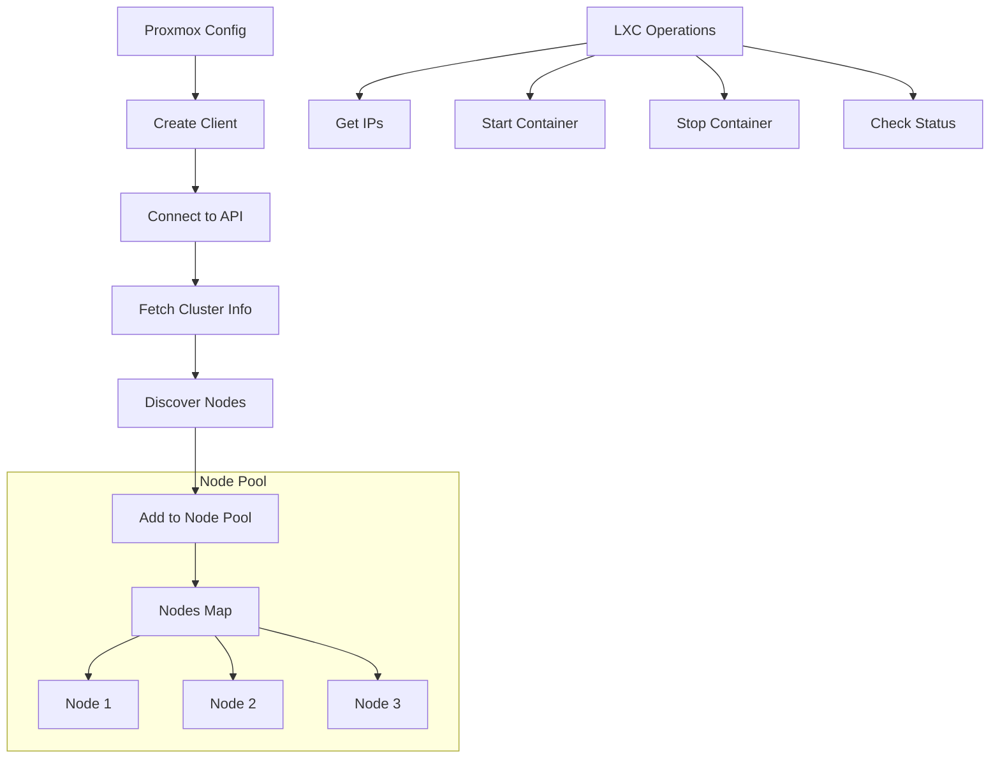
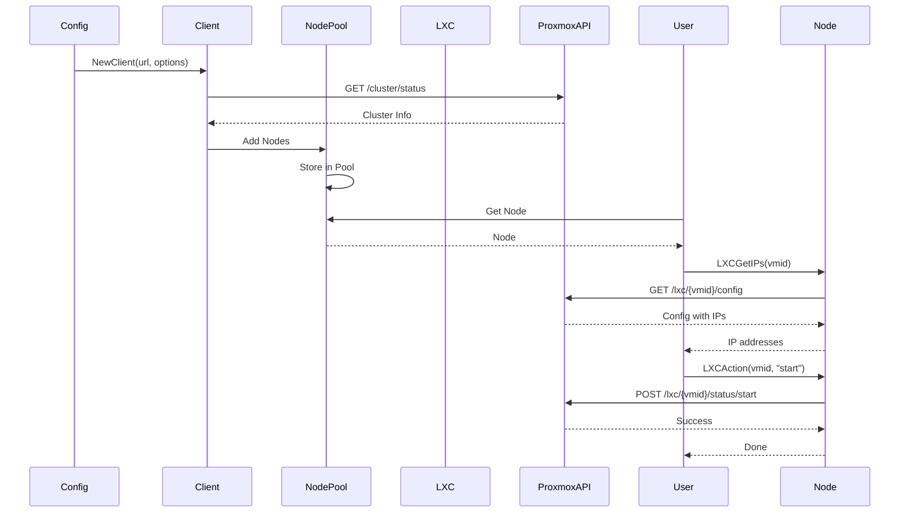

# Proxmox

The proxmox package provides Proxmox VE integration for GoDoxy, enabling management of Proxmox LXC containers.

## Overview

The proxmox package implements Proxmox API client management, node discovery, and LXC container operations including power management and IP address retrieval.

### Key Features

- Proxmox API client management
- Node discovery and pool management
- LXC container operations (start, stop, status)
- IP address retrieval for containers
- TLS configuration options
- Token-based authentication

## Architecture



## Core Components

### Config

```go
type Config struct {
    URL       string            `json:"url" validate:"required,url"`
    TokenID   string            `json:"token_id" validate:"required"`
    Secret    strutils.Redacted `json:"secret" validate:"required"`
    NoTLSVerify bool            `json:"no_tls_verify"`

    client *Client
}
```

### Client

```go
type Client struct {
    *proxmox.Client
    proxmox.Cluster
    Version *proxmox.Version
}
```

### Node

```go
type Node struct {
    name   string
    id     string
    client *proxmox.Client
}

var Nodes = pool.New[*Node]("proxmox_nodes")
```

## Public API

### Configuration

```go
// Init initializes the Proxmox client.
func (c *Config) Init(ctx context.Context) gperr.Error

// Client returns the Proxmox client.
func (c *Config) Client() *Client
```

### Node Operations

```go
// AvailableNodeNames returns all available node names.
func AvailableNodeNames() string
```

## Usage

### Basic Setup

```go
proxmoxCfg := &proxmox.Config{
    URL:         "https://proxmox.example.com:8006",
    TokenID:     "user@pam!token-name",
    Secret:      "your-api-token-secret",
    NoTLSVerify: false,
}

ctx := context.Background()
err := proxmoxCfg.Init(ctx)
if err != nil {
    log.Fatal(err)
}

client := proxmoxCfg.Client()
```

### Node Access

```go
// Get a specific node
node, ok := proxmox.Nodes.Get("pve")
if !ok {
    log.Fatal("Node not found")
}

fmt.Printf("Node: %s (%s)\n", node.Name(), node.Key())
```

### Available Nodes

```go
names := proxmox.AvailableNodeNames()
fmt.Printf("Available nodes: %s\n", names)
```

## LXC Operations

### Get Container IPs

```go
func getContainerIPs(ctx context.Context, node *proxmox.Node, vmid int) ([]net.IP, error) {
    var ips []net.IP

    err := node.Get(ctx, "/lxc/"+strconv.Itoa(vmid)+"/config", &config)
    if err != nil {
        return nil, err
    }

    // Parse IP addresses from config
    for _, ip := range config {
        if ipNet := net.ParseCIDR(ip); ipNet != nil {
            ips = append(ips, ipNet.IP)
        }
    }

    return ips, nil
}
```

### Check Container Status

```go
func (node *Node) LXCIsRunning(ctx context.Context, vmid int) (bool, error) {
    var status struct {
        Status string `json:"status"`
    }

    err := node.Get(ctx, "/lxc/"+strconv.Itoa(vmid)+"/status/current", &status)
    if err != nil {
        return false, err
    }

    return status.Status == "running", nil
}
```

### Start Container

```go
func (node *Node) LXCAction(ctx context.Context, vmid int, action string) error {
    return node.Post(ctx,
        "/lxc/"+strconv.Itoa(vmid)+"/status/"+action,
        nil,
        nil,
    )
}

const LXCStart = "start"
```

## Data Flow



## Configuration

### YAML Configuration

```yaml
providers:
  proxmox:
    - url: https://proxmox.example.com:8006
      token_id: user@pam!token-name
      secret: your-api-token-secret
      no_tls_verify: false
```

### TLS Configuration

```go
// With TLS verification (default)
tr := gphttp.NewTransport()

// Without TLS verification (insecure)
tr := gphttp.NewTransportWithTLSConfig(&tls.Config{
    InsecureSkipVerify: true,
})
```

## Node Pool

The package maintains a global node pool:

```go
var Nodes = pool.New[*Node]("proxmox_nodes")
```

### Pool Operations

```go
// Add a node
Nodes.Add(&Node{name: "pve1", id: "node/pve1", client: client})

// Get a node
node, ok := Nodes.Get("pve1")

// Iterate nodes
for _, node := range Nodes.Iter {
    fmt.Printf("Node: %s\n", node.Name())
}
```

## Integration with Route

The proxmox package integrates with the route package for idlewatcher:

```go
// In route validation
if r.Idlewatcher != nil && r.Idlewatcher.Proxmox != nil {
    node := r.Idlewatcher.Proxmox.Node
    vmid := r.Idlewatcher.Proxmox.VMID

    node, ok := proxmox.Nodes.Get(node)
    if !ok {
        return gperr.Errorf("proxmox node %s not found", node)
    }

    // Get container IPs
    ips, err := node.LXCGetIPs(ctx, vmid)
    // ... check reachability
}
```

## Authentication

The package uses API tokens for authentication:

```go
opts := []proxmox.Option{
    proxmox.WithAPIToken(c.TokenID, c.Secret.String()),
    proxmox.WithHTTPClient(&http.Client{
        Transport: tr,
    }),
}
```

## Error Handling

```go
// Timeout handling
if errors.Is(err, context.DeadlineExceeded) {
    return gperr.New("timeout fetching proxmox cluster info")
}

// Connection errors
return gperr.New("failed to fetch proxmox cluster info").With(err)
```

## Performance Considerations

- Cluster info fetched once on init
- Nodes cached in pool
- Per-operation API calls
- 3-second timeout for initial connection
