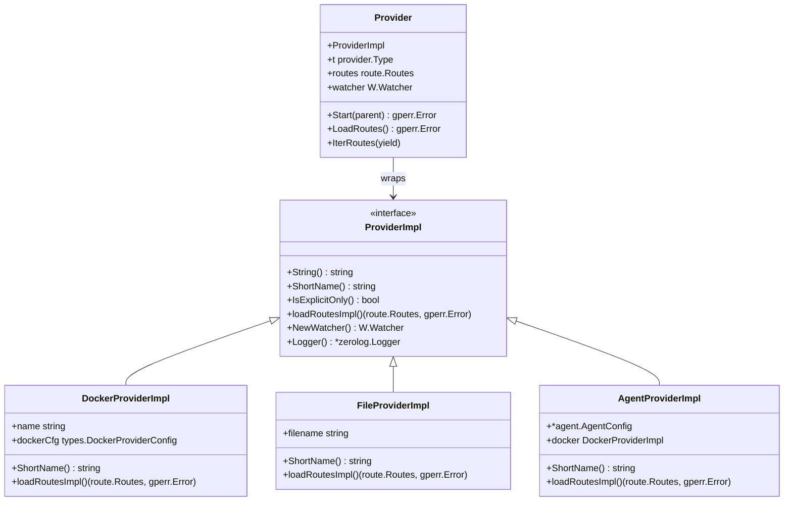
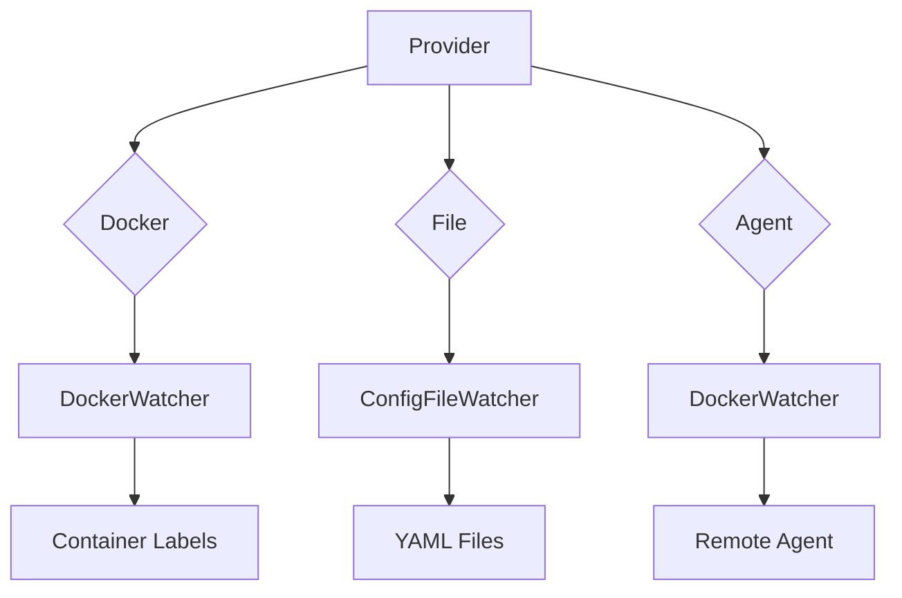
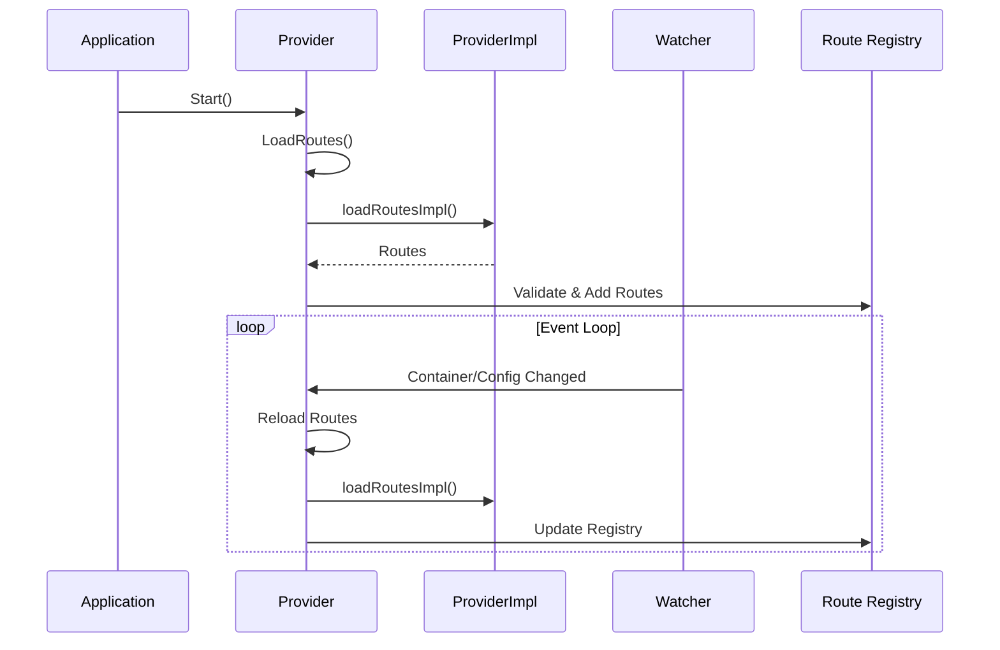

# Route Provider

Discovers and loads routes from Docker containers, YAML files, and remote agents.

## Overview

The `internal/route/provider` package implements route discovery and loading for GoDoxy. It supports multiple provider types (Docker, File, Agent) and manages route lifecycle including validation, start/stop, and event handling.

### Primary Consumers

- **Main entry point**: Creates providers during startup
- **Route layer**: Provides route instances to registry
- **Watcher system**: Receives container/config change events

### Non-goals

- Does not implement route execution (handled by route package)
- Does not manage global configuration
- Does not provide authentication

### Stability

Internal package with stable provider interface.

## Public API

### Exported Types

```go
type Provider struct {
    ProviderImpl
    t        provider.Type
    routes   route.Routes
    routesMu sync.RWMutex
    watcher  W.Watcher
}

type ProviderImpl interface {
    fmt.Stringer
    ShortName() string
    IsExplicitOnly() bool
    loadRoutesImpl() (route.Routes, gperr.Error)
    NewWatcher() W.Watcher
    Logger() *zerolog.Logger
}
```

### Exported Functions

```go
// Create a file-based provider
func NewFileProvider(filename string) (p *Provider, err error)

// Create a Docker-based provider
func NewDockerProvider(name string, dockerCfg types.DockerProviderConfig) *Provider

// Create an agent-based provider
func NewAgentProvider(cfg *agent.AgentConfig) *Provider
```

### Provider Methods

```go
func (p *Provider) GetType() provider.Type
func (p *Provider) Start(parent task.Parent) gperr.Error
func (p *Provider) LoadRoutes() gperr.Error
func (p *Provider) IterRoutes(yield func(string, types.Route) bool)
func (p *Provider) GetRoute(alias string) (types.Route, bool)
func (p *Provider) FindService(project, service string) (types.Route, bool)
```

## Architecture

### Core Components



### Provider Types



### Route Loading Flow



### Docker Provider Features

- Lists all containers and reads their labels
- Supports Docker Compose project/service discovery
- Handles host network mode with port detection
- Supports alias references (`#1`, `#2` for container aliases)
- Explicit-only mode for providers ending with `!`

### File Provider Features

- Reads YAML files from the config directory
- Validates routes on load
- Supports embedded presets

### Agent Provider Features

- Connects to a remote agent via Unix socket or TCP
- Delegates to a Docker provider internally
- Supports the same Docker label-based route discovery

## Configuration Surface

### Docker Provider Labels

```yaml
labels:
  proxy.aliases: app1,app2
  proxy.app1.listen: http://0.0.0.0:8080
  proxy.app1.target: http://app:3000
  proxy.app1.rules: |
    - name: default
      do: pass
```

### File Provider Configuration

```yaml
# config/routes/myapp.yml
routes:
  myapp:
    target: http://localhost:8080
    rules:
      - name: default
        do: pass
```

### Agent Provider Configuration

```yaml
agents:
  remote:
    socket: /run/godoxy-agent.sock
    name: remote-agent
```

## Dependency and Integration Map

| Dependency                       | Purpose                    |
| -------------------------------- | -------------------------- |
| `internal/route`                 | Route types and validation |
| `internal/route/routes`          | Route registry             |
| `internal/docker`                | Docker API integration     |
| `internal/serialization`         | YAML parsing               |
| `internal/watcher`               | Container/config watching  |
| `internal/watcher/events`        | Event queue handling       |
| `agent/pkg/agent`                | Agent configuration        |
| `github.com/yusing/goutils/errs` | Error handling             |

## Observability

### Logs

- **INFO**: Provider start/stop, route count
- **DEBUG**: Route loading details, label parsing
- **ERROR**: Container fetch errors, parse failures

Log context includes: `provider`, `alias`, `route_count`

### Metrics

- `routes_loaded_total` by provider
- `provider_events_total` by type

## Security Considerations

- Docker provider requires socket access
- Agent provider uses Unix socket or TCP with auth
- Route validation prevents SSRF via URL validation
- Container labels are validated before use

## Failure Modes and Recovery

| Failure                   | Behavior                     | Recovery                |
| ------------------------- | ---------------------------- | ----------------------- |
| Docker socket unavailable | Provider fails to start      | Fix socket permissions  |
| Container not found       | Route excluded with error    | Verify container exists |
| YAML parse error          | Route excluded, error logged | Fix configuration file  |
| Agent connection lost     | Routes removed, reconnection | Fix agent connectivity  |
| Watcher error             | Provider finishes with error | Check watcher logs      |

## Usage Examples

### Creating a Docker Provider

```go
provider := provider.NewDockerProvider("default", types.DockerProviderConfig{
    URL: "unix:///var/run/docker.sock",
})

if err := provider.LoadRoutes(); err != nil {
    return err
}

if err := provider.Start(parentTask); err != nil {
    return err
}
```

### Creating a File Provider

```go
provider, err := provider.NewFileProvider("routes/myapp.yml")
if err != nil {
    return err
}

if err := provider.Start(parentTask); err != nil {
    return err
}
```

### Iterating Over Routes

```go
for alias, r := range provider.IterRoutes {
    log.Printf("Route: %s -> %s", alias, r.Name())
}
```

### Finding a Service

```go
route, ok := provider.FindService("myproject", "myservice")
if ok {
    log.Printf("Found service: %s", route.Name())
}
```

## Testing Notes

- Docker provider tests use test containers
- File provider tests use temp directories
- Agent provider tests use mock agents
- Integration tests cover event handling
