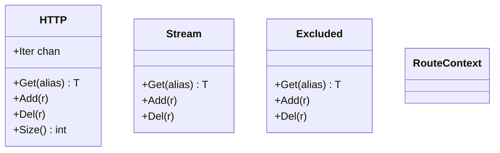
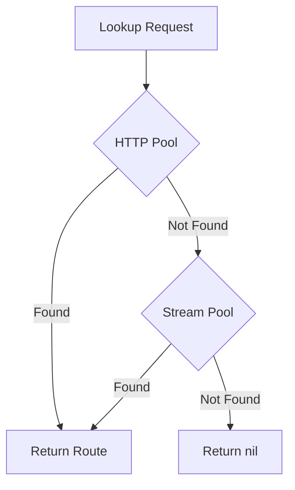
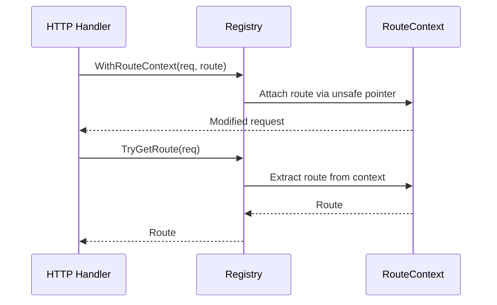

# Route Registry

Provides centralized route registry with O(1) lookups and route context management for HTTP handlers.

## Overview

The `internal/route/routes` package maintains the global route registry for GoDoxy. It provides thread-safe route lookups by alias, route iteration, and utilities for propagating route context through HTTP request handlers.

### Primary Consumers

- **HTTP handlers**: Lookup routes and extract request context
- **Route providers**: Register and unregister routes
- **Health system**: Query route health status
- **WebUI**: Display route information

### Non-goals

- Does not create or modify routes
- Does not handle route validation
- Does not implement routing logic (matching)

### Stability

Internal package with stable public API.

## Public API

### Route Pools

```go
var (
    HTTP = pool.New[types.HTTPRoute]("http_routes")
    Stream = pool.New[types.StreamRoute]("stream_routes")
    Excluded = pool.New[types.Route]("excluded_routes")
)
```

Pool methods:

- `Get(alias string) (T, bool)` - O(1) lookup
- `Add(r T)` - Register route
- `Del(r T)` - Unregister route
- `Size() int` - Route count
- `Clear()` - Remove all routes
- `Iter` - Channel-based iteration

### Exported Functions

```go
// Iterate over active routes (HTTP + Stream)
func IterActive(yield func(r types.Route) bool)

// Iterate over all routes (HTTP + Stream + Excluded)
func IterAll(yield func(r types.Route) bool)

// Get route count
func NumActiveRoutes() int
func NumAllRoutes() int

// Clear all routes
func Clear()

// Lookup functions
func Get(alias string) (types.Route, bool)
func GetHTTPRouteOrExact(alias, host string) (types.HTTPRoute, bool)
```

### Route Context

```go
type RouteContext struct {
    context.Context
    Route types.HTTPRoute
}

// Attach route to request context (uses unsafe pointer for performance)
func WithRouteContext(r *http.Request, route types.HTTPRoute) *http.Request

// Extract route from request context
func TryGetRoute(r *http.Request) types.HTTPRoute
```

### Upstream Information

```go
func TryGetUpstreamName(r *http.Request) string
func TryGetUpstreamScheme(r *http.Request) string
func TryGetUpstreamHost(r *http.Request) string
func TryGetUpstreamPort(r *http.Request) string
func TryGetUpstreamHostPort(r *http.Request) string
func TryGetUpstreamAddr(r *http.Request) string
func TryGetUpstreamURL(r *http.Request) string
```

### Health Information

```go
type HealthInfo struct {
    HealthInfoWithoutDetail
    Detail string
}

type HealthInfoWithoutDetail struct {
    Status  types.HealthStatus
    Uptime  time.Duration
    Latency time.Duration
}

func GetHealthInfo() map[string]HealthInfo
func GetHealthInfoWithoutDetail() map[string]HealthInfoWithoutDetail
func GetHealthInfoSimple() map[string]types.HealthStatus
```

### Provider Grouping

```go
func ByProvider() map[string][]types.Route
```

## Architecture

### Core Components



### Route Lookup Flow



### Context Propagation



## Dependency and Integration Map

| Dependency                       | Purpose                           |
| -------------------------------- | --------------------------------- |
| `internal/types`                 | Route and health type definitions |
| `github.com/yusing/goutils/pool` | Thread-safe pool implementation   |

## Observability

### Logs

Registry operations logged at DEBUG level:

- Route add/remove
- Pool iteration
- Context operations

### Performance

- `WithRouteContext` uses `unsafe.Pointer` to avoid request cloning
- Route lookups are O(1) using internal maps
- Iteration uses channels for memory efficiency

## Security Considerations

- Route context propagation is internal to the process
- No sensitive data exposed in context keys
- Routes are validated before registration

## Failure Modes and Recovery

| Failure                                  | Behavior                       | Recovery             |
| ---------------------------------------- | ------------------------------ | -------------------- |
| Route not found                          | Returns (nil, false)           | Verify route alias   |
| Context extraction on non-route request  | Returns nil                    | Check request origin |
| Concurrent modification during iteration | Handled by pool implementation | N/A                  |

## Usage Examples

### Basic Route Lookup

```go
route, ok := routes.Get("myapp")
if !ok {
    return fmt.Errorf("route not found")
}
```

### Iterating Over All Routes

```go
for r := range routes.IterActive {
    log.Printf("Route: %s", r.Name())
}
```

### Getting Health Status

```go
healthMap := routes.GetHealthInfo()
for name, health := range healthMap {
    log.Printf("Route %s: %s (uptime: %v)", name, health.Status, health.Uptime)
}
```

### Using Route Context in Handler

```go
func MyHandler(w http.ResponseWriter, r *http.Request) {
    route := routes.TryGetRoute(r)
    if route == nil {
        http.Error(w, "Route not found", http.StatusNotFound)
        return
    }

    upstreamHost := routes.TryGetUpstreamHost(r)
    log.Printf("Proxying to: %s", upstreamHost)
}
```

### Grouping Routes by Provider

```go
byProvider := routes.ByProvider()
for providerName, routeList := range byProvider {
    log.Printf("Provider %s: %d routes", providerName, len(routeList))
}
```

## Testing Notes

- Unit tests for pool thread safety
- Context propagation tests
- Health info aggregation tests
- Provider grouping tests
