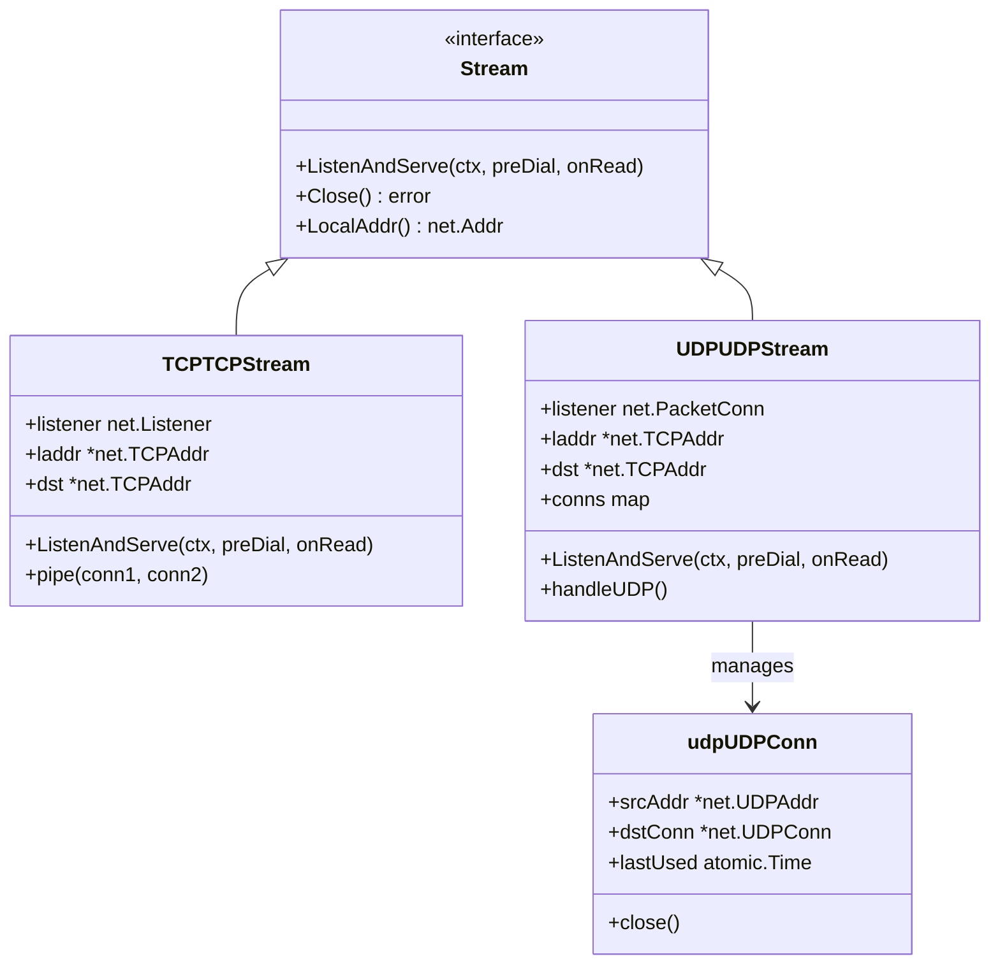
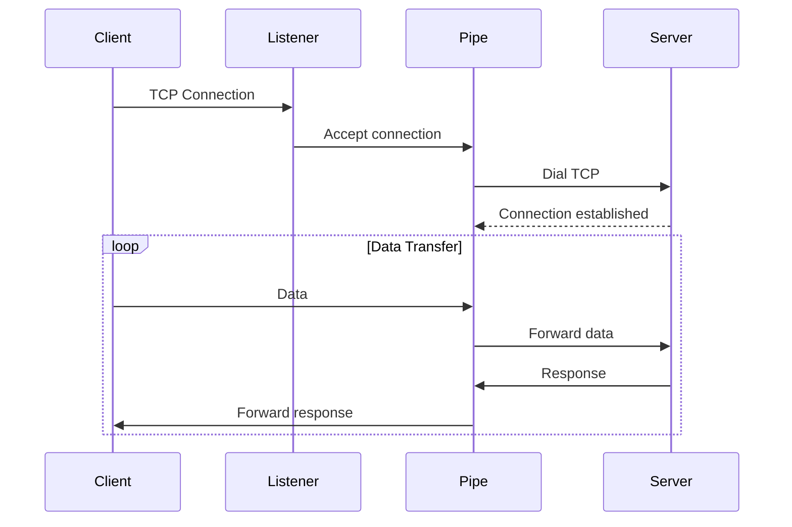
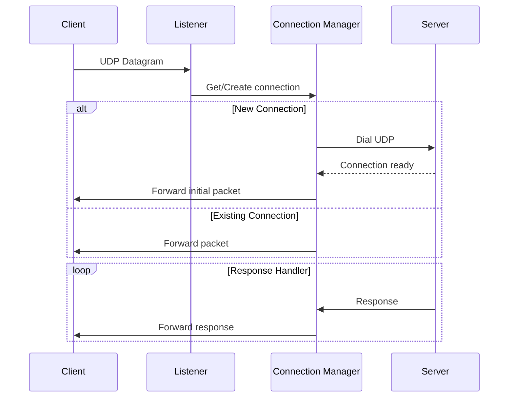

# Stream Handling

Implements TCP and UDP stream proxying for non-HTTP protocols.

## Overview

The `internal/route/stream` package provides protocol-agnostic proxying of TCP and UDP connections. It enables GoDoxy to handle protocols like SSH, DNS, game servers, and other binary protocols that don't use HTTP.

### Primary Consumers

- **Route layer**: Creates stream routes for TCP/UDP schemes
- **Entry point**: Mounts stream listeners
- **ACL system**: Applies access control to listeners

### Non-goals

- Does not implement HTTP/1.1 or HTTP/2 (handled by reverse proxy)
- Does not handle WebSocket (handled by rules engine)
- Does not provide protocol-specific parsing

### Stability

Internal package with stable `nettypes.Stream` interface.

## Public API

### Exported Types

```go
type TCPTCPStream struct {
    network  string
    listener net.Listener
    laddr    *net.TCPAddr
    dst      *net.TCPAddr
    preDial  nettypes.HookFunc
    onRead   nettypes.HookFunc
    closed   atomic.Bool
}

type UDPUDPStream struct {
    network   string
    listener  net.PacketConn
    laddr     *net.UDPAddr
    dst       *net.TCPAddr
    cleanUpTicker *time.Ticker
    conns     map[string]*udpUDPConn
    closed    atomic.Bool
    mu        sync.Mutex
}
```

### Exported Functions

```go
// Create a TCP stream
func NewTCPTCPStream(network, listenAddr, dstAddr string) (nettypes.Stream, error)

// Create a UDP stream
func NewUDPUDPStream(network, listenAddr, dstAddr string) (nettypes.Stream, error)
```

### Stream Interface

```go
type Stream interface {
    ListenAndServe(ctx context.Context, preDial, onRead HookFunc)
    Close() error
    LocalAddr() net.Addr
    zerolog.LogObjectMarshaler
}

type HookFunc func(ctx context.Context) error
```

## Architecture

### Core Components



### TCP Stream Flow



### UDP Stream Flow



### Constants

```go
const (
    udpBufferSize      = 16 * 1024  // 16KB buffer
    udpIdleTimeout     = 5 * time.Minute
    udpCleanupInterval = 1 * time.Minute
    udpReadTimeout     = 30 * time.Second
)
```

## Configuration Surface

### Route Configuration

```yaml
routes:
  ssh-proxy:
    scheme: tcp4
      bind: 0.0.0.0 # optional
      port: 2222:22 # listening port: target port

  dns-proxy:
    scheme: udp4
    bind: 0.0.0.0 # optional
    port: 53:53 # listening port: target port
```

### Docker Labels

```yaml
services:
  ssh:
    image: alpine/ssh
    labels:
      proxy.aliases: ssh
      proxy.ssh.port: 2222:22 # listening port: target port
```

## Dependency and Integration Map

| Dependency                       | Purpose                      |
| -------------------------------- | ---------------------------- |
| `internal/acl`                   | Access control for listeners |
| `internal/entrypoint`            | Proxy protocol support       |
| `internal/net/types`             | Stream interface definitions |
| `github.com/pires/go-proxyproto` | PROXY protocol header        |
| `github.com/yusing/goutils/errs` | Error handling               |

## Observability

### Logs

- **INFO**: Stream start/stop, connection accepted
- **DEBUG**: Data transfer, connection details
- **ERROR**: Accept failures, pipe errors

Log context includes: `protocol`, `listen`, `dst`, `action`

## Security Considerations

- ACL wrapping available for TCP and UDP listeners
- PROXY protocol support for original client IP
- No protocol validation (relies on upstream)
- Connection limits managed by OS

## Failure Modes and Recovery

| Failure          | Behavior              | Recovery                |
| ---------------- | --------------------- | ----------------------- |
| Bind fails       | Stream creation error | Check port availability |
| Dial fails       | Connection error      | Fix target address      |
| Pipe broken      | Connection closed     | Client reconnects       |
| UDP idle timeout | Connection removed    | Client reconnects       |

## Usage Examples

### Creating a TCP Stream Route

```go
baseRoute := &route.Route{
    LisURL:   &url.URL{Scheme: "tcp4", Host: ":2222"},
    ProxyURL: &url.URL{Scheme: "tcp", Host: "localhost:22"},
}

streamRoute, err := route.NewStreamRoute(baseRoute)
if err != nil {
    return err
}
```

### Programmatic Stream Creation

```go
tcpStream, err := stream.NewTCPTCPStream("tcp", ":8080", "localhost:22")
if err != nil {
    return err
}

tcpStream.ListenAndServe(ctx, preDialHook, onReadHook)
```

### Using Hook Functions

```go
stream.ListenAndServe(ctx,
    func(ctx context.Context) error {
        // Pre-dial: authentication, rate limiting
        log.Println("Pre-dial check")
        return nil
    },
    func(ctx context.Context) error {
        // On-read: metrics, throttling
        return nil
    },
)
```

### ACL Integration

```go
stream := tcpStream
if acl := acl.ActiveConfig.Load(); acl != nil {
    stream.listener = acl.WrapTCP(stream.listener)
    // or for UDP
    stream.listener = acl.WrapUDP(stream.listener)
}
```

## Performance Considerations

- **TCP**: Bidirectional pipe with goroutines per connection
- **UDP**: 16KB buffer with sized pool
- **Cleanup**: Periodic cleanup of idle UDP connections
- **Concurrency**: Each connection handled independently

## Limitations

- Load balancing not yet supported
- Coherent scheme required:
  - `tcp4`/`tcp6` -> `tcp`
  - `udp4`/`udp6` -> `udp`
- No UDP broadcast/multicast support
