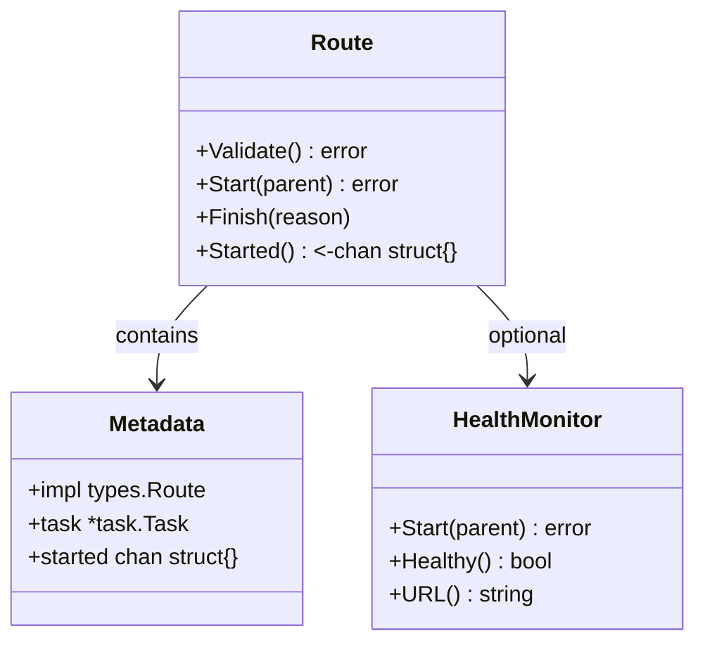
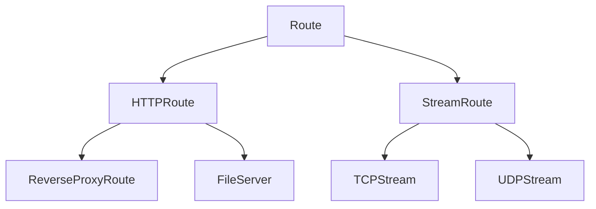
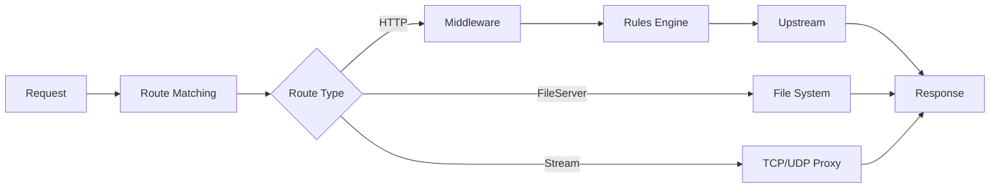
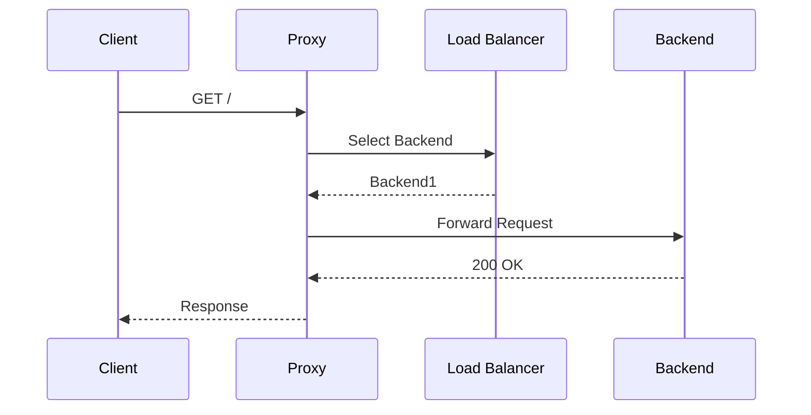

# Route

Provides HTTP routing, reverse proxy, file serving, and TCP/UDP stream proxying for GoDoxy.

## Overview

The `internal/route` package implements the core routing system for GoDoxy. It handles reverse proxying HTTP requests, serving static files, and proxying TCP/UDP streams. Routes can be discovered from Docker containers, YAML files, or remote agents.

### Primary Consumers

- **Route providers**: Create and manage route instances
- **HTTP server**: Dispatches requests to route handlers
- **Configuration layer**: Validates and loads route configs

### Non-goals

- Does not implement container runtime operations (delegates to providers)
- Does not handle authentication (delegates to middleware/rules)
- Does not manage health checks (delegates to `internal/health/monitor`)

### Stability

Internal package with stable core types. Route configuration schema is versioned.

## Public API

### Exported Types

```go
type Route struct {
    Alias  string       // Unique route identifier
    Scheme Scheme       // http, https, h2c, tcp, udp, fileserver
    Host   string       // Target host
    Port   Port         // Listen and target ports

    Bind   string       // Bind address for listening (IP address, optional)

    // File serving
    Root  string        // Document root
    SPA   bool          // Single-page app mode
    Index string        // Index file

    // Route rules and middleware
    HTTPConfig
    PathPatterns []string
    Rules        rules.Rules
    RuleFile     string

    // Health and load balancing
    HealthCheck types.HealthCheckConfig
    LoadBalance *types.LoadBalancerConfig

    // Additional features
    Middlewares map[string]types.LabelMap
    Homepage    *homepage.ItemConfig
    AccessLog   *accesslog.RequestLoggerConfig
    Agent       string
    Idlewatcher *types.IdlewatcherConfig

    Metadata
}
```

```go
type Scheme string

const (
    SchemeHTTP      Scheme = "http"
    SchemeHTTPS     Scheme = "https"
    SchemeH2C       Scheme = "h2c"
    SchemeTCP       Scheme = "tcp"
    SchemeUDP       Scheme = "udp"
    SchemeFileServer Scheme = "fileserver"
)
```

```go
type ExcludedReason int

const (
    ExcludedReasonNone ExcludedReason = iota
    ExcludedReasonError
    ExcludedReasonManual
    ExcludedReasonNoPortContainer
    ExcludedReasonNoPortSpecified
    ExcludedReasonBlacklisted
    ExcludedReasonBuildx
    ExcludedReasonOld
)
```

### Exported Functions/Methods

```go
// Validation and lifecycle
func (r *Route) Validate() error
func (r *Route) Start(parent task.Parent) error
func (r *Route) Finish(reason any)
func (r *Route) Started() <-chan struct{}

// Route queries
func (r *Route) Impl() types.Route
func (r *Route) Task() *task.Task
func (r *Route) ProviderName() string
func (r *Route) TargetURL() *nettypes.URL
func (r *Route) References() []string

// Status queries
func (r *Route) ShouldExclude() bool
func (r *Route) UseLoadBalance() bool
func (r *Route) UseIdleWatcher() bool
func (r *Route) UseHealthCheck() bool
```

## Architecture

### Core Components



### Route Types



### Request Processing Pipeline



### Reverse Proxy Flow



## Configuration Surface

### Route Configuration

```go
type Route struct {
    Alias  string       `json:"alias"`
    Scheme Scheme       `json:"scheme"`
    Host   string       `json:"host,omitempty"`
    Bind   string       `json:"bind,omitempty"`  // Listen bind address
    Port   Port         `json:"port"`
    Root   string       `json:"root,omitempty"`
    SPA    bool         `json:"spa,omitempty"`
    Index  string       `json:"index,omitempty"`
    // ... additional fields
}
```

### Docker Labels

```yaml
labels:
  proxy.aliases: myapp
  proxy.myapp.port: 3000
```

### YAML Configuration

```yaml
routes:
  myapp:
    scheme: http
    host: myapp.local
    bind: 192.168.1.100 # Optional: bind to specific address
    port:
      proxy: 80
      target: 3000
```

## Dependency and Integration Map

| Dependency                         | Purpose                           |
| ---------------------------------- | --------------------------------- |
| `internal/route/routes/context.go` | Route context helpers (only file) |
| `internal/route/rules`             | Request/response rule processing  |
| `internal/route/stream`            | TCP/UDP stream proxying           |
| `internal/route/provider`          | Route discovery and loading       |
| `internal/health/monitor`          | Health checking                   |
| `internal/idlewatcher`             | Idle container management         |
| `internal/logging/accesslog`       | Request logging                   |
| `internal/homepage`                | Dashboard integration             |
| `github.com/yusing/goutils/errs`   | Error handling                    |

## Observability

### Logs

- **INFO**: Route start/stop, validation results
- **DEBUG**: Request processing details
- **ERROR**: Proxy failures, health check failures

Log context includes: `alias`, `host`, `method`, `path`, `status`

### Metrics

Health check metrics via `internal/health/monitor`:

- `health_check_total`
- `health_check_failure_total`
- `health_check_duration_seconds`

## Security Considerations

- Route matching validates host and path patterns
- Upstream URL validation prevents SSRF attacks
- Rules engine can enforce authentication/authorization
- ACL integration available for IP-based access control

## Failure Modes and Recovery

| Failure                   | Behavior                   | Recovery                    |
| ------------------------- | -------------------------- | --------------------------- |
| Backend unavailable       | Returns 502 error          | Fix backend service         |
| Health check fails        | Route marked unhealthy     | Fix backend health endpoint |
| Route validation fails    | Route excluded with reason | Fix configuration           |
| TLS handshake fails       | Connection error           | Fix certificates            |
| Load balancer no backends | Returns 503 error          | Add healthy backends        |

## Usage Examples

### Creating a Basic HTTP Route

```go
route := &route.Route{
    Alias:  "myapp",
    Scheme: route.SchemeHTTP,
    Host:   "myapp.local",
    Port:   route.Port{Proxy: 8080, Target: 3000},
}

if err := route.Validate(); err != nil {
    return err
}

if err := route.Start(parent); err != nil {
    return err
}
```

### Route with Health Check

```go
route := &route.Route{
    Alias: "myservice",
    HealthCheck: types.HealthCheckConfig{
        Path:     "/health",
        Interval: 30 * time.Second,
        Timeout:  5 * time.Second,
    },
}
```

### Route with Custom Bind Address

```go
route := &route.Route{
    Alias:  "myapp",
    Scheme: route.SchemeHTTP,
    Host:   "myapp.local",
    Bind:   "192.168.1.100",  // Bind to specific interface
    Port:   route.Port{Listening: 8443, Proxy: 80},
}
```

### File Server Route

```go
route := &route.Route{
    Alias:  "files",
    Scheme: route.SchemeFileServer,
    Root:   "/var/www/files",
    SPA:    false,
    Index:  "index.html",
}
```

## Testing Notes

- Unit tests for validation logic
- Integration tests with real backends
- Mock health monitors for testing
- Route exclusion tests cover all reason codes
