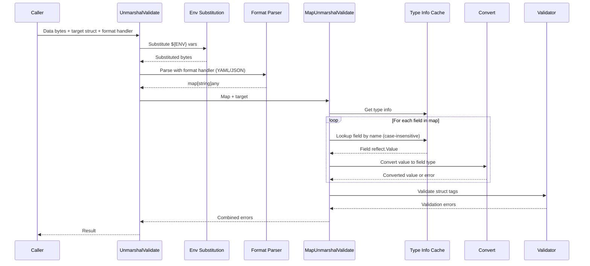
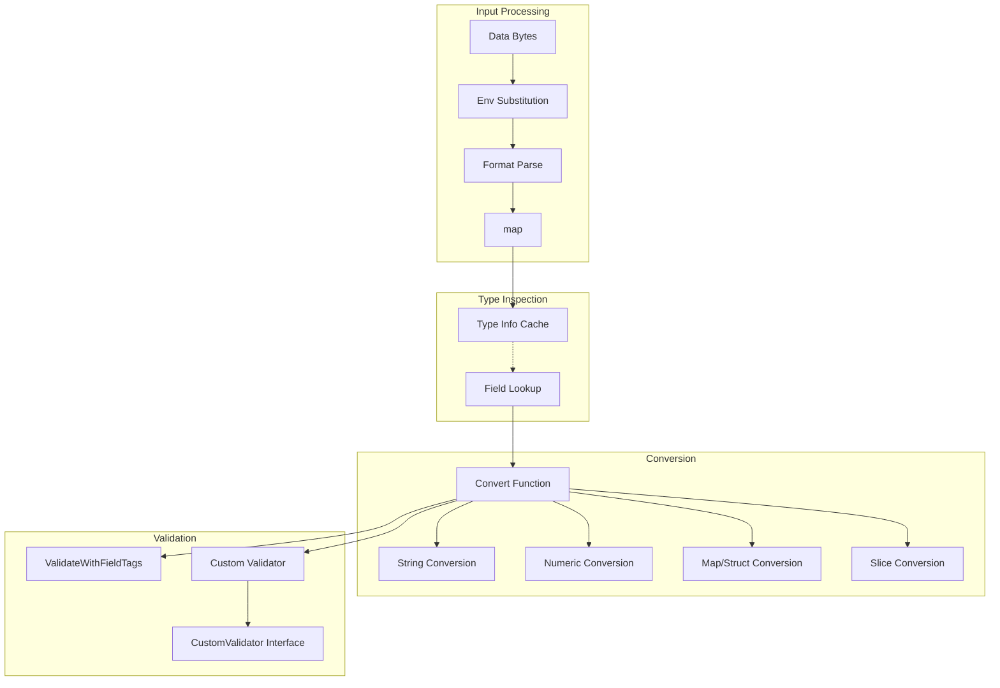

# Serialization Package

Flexible, type-safe serialization/deserialization with validation support for GoDoxy configuration.

## Overview

### Purpose

This package provides robust YAML/JSON serialization with:

- Case-insensitive field matching using FNV-1a hashing
- Environment variable substitution (`${VAR}` syntax)
- Field-level validation with go-playground/validator tags
- Custom type conversion with pluggable format handlers

### Primary Consumers

- `internal/config/` - Configuration file loading
- `internal/autocert/` - ACME provider configuration
- `internal/route/` - Route configuration

### Non-goals

- Binary serialization (MsgPack, etc.)
- Schema evolution/migration
- Partial deserialization (unknown fields error)

### Stability

Internal package with stable public APIs. Exported functions are production-ready.

## Public API

### Core Types

```go
// Intermediate representation during deserialization
type SerializedObject = map[string]any
```

### Interfaces

```go
// For custom map unmarshaling logic
type MapUnmarshaller interface {
    UnmarshalMap(m map[string]any) gperr.Error
}

// For custom validation logic
type CustomValidator interface {
    Validate() gperr.Error
}
```

### Deserialization Functions

```go
// Generic unmarshal with pluggable format handler
func UnmarshalValidate[T any](data []byte, target *T, unmarshaler unmarshalFunc, interceptFns ...interceptFunc) gperr.Error

// Read from io.Reader with format decoder
func UnmarshalValidateReader[T any](reader io.Reader, target *T, newDecoder newDecoderFunc, interceptFns ...interceptFunc) gperr.Error

// Direct map deserialization
func MapUnmarshalValidate(src SerializedObject, dst any) gperr.Error

// To xsync.Map with pluggable format handler
func UnmarshalValidateXSync[V any](data []byte, unmarshaler unmarshalFunc, interceptFns ...interceptFunc) (*xsync.Map[string, V], gperr.Error)
```

### File I/O Functions

```go
// Write marshaled data to file
func SaveFile[T any](path string, src *T, perm os.FileMode, marshaler marshalFunc) error

// Read and unmarshal file if it exists
func LoadFileIfExist[T any](path string, dst *T, unmarshaler unmarshalFunc) error
```

### Conversion Functions

```go
// Convert any value to target reflect.Value
func Convert(src reflect.Value, dst reflect.Value, checkValidateTag bool) gperr.Error

// String to target type conversion
func ConvertString(src string, dst reflect.Value) (convertible bool, convErr gperr.Error)
```

### Validation Functions

```go
// Validate using struct tags
func ValidateWithFieldTags(s any) gperr.Error

// Register custom validator
func MustRegisterValidation(tag string, fn validator.Func)

// Validate using CustomValidator interface
func ValidateWithCustomValidator(v reflect.Value) gperr.Error

// Get underlying validator
func Validator() *validator.Validate
```

### Utility Functions

```go
// Register default value factory
func RegisterDefaultValueFactory[T any](factory func() *T)

// Convert map to SerializedObject
func ToSerializedObject[VT any](m map[string]VT) SerializedObject
```

## Architecture

### Data Flow



### Component Interactions



### Field Tag Reference

| Tag           | Purpose                            | Example                     |
| ------------- | ---------------------------------- | --------------------------- |
| `json`        | Field name for serialization       | `json:"auth_token"`         |
| `deserialize` | Exclude field from deserialization | `deserialize:"-"`           |
| `validate`    | go-playground/validator tags       | `validate:"required,email"` |
| `aliases`     | Alternative field names            | `aliases:"key,api_key"`     |

## Configuration Surface

### Supported Field Types

- Primitives (string, int, bool, float)
- Pointers to primitives
- Slices of primitives
- Maps with string keys
- Nested structs
- Time.Duration (with extended units: `d`, `w`, `M`)

### Environment Variable Substitution

```yaml
autocert:
  auth_token: ${CLOUDFLARE_AUTH_TOKEN}
  # Lookup order: GODOXY_VAR, GOPROXY_VAR, VAR
```

### String Conversion Formats

| Type       | Format Examples             |
| ---------- | --------------------------- |
| Duration   | `1h30m`, `2d`, `1w`, `3M`   |
| Numeric    | `123`, `0xFF`, `-42`        |
| Slice      | `a,b,c` or YAML list format |
| Map/Struct | YAML key: value format      |

## Dependency and Integration Map

### External Dependencies

- `github.com/goccy/go-yaml` - YAML parsing
- `github.com/go-playground/validator/v10` - Validation
- `github.com/puzpuzpuz/xsync/v4` - Type cache
- `github.com/bytedance/sonic` - JSON operations

### Internal Dependencies

- `github.com/yusing/goutils/errs` - Error handling
- `github.com/yusing/gointernals` - Reflection utilities

## Observability

### Errors

All errors use `gperr` with structured subjects:

```go
ErrUnknownField.Subject("field_name").With(gperr.DoYouMeanField("field_name", ["fieldName"]))
ErrValidationError.Subject("Namespace").Withf("required")
ErrUnsupportedConversion.Subjectf("string to int")
```

## Performance Characteristics

| Operation        | Complexity | Notes                            |
| ---------------- | ---------- | -------------------------------- |
| Type info lookup | O(1)       | Cached in xsync.Map              |
| Field matching   | O(1)       | FNV-1a hash lookup               |
| Conversion       | O(n)       | n = number of fields             |
| Validation       | O(n)       | n = number of validatable fields |

## Failure Modes and Recovery

| Failure Mode       | Result                 | Recovery                 |
| ------------------ | ---------------------- | ------------------------ |
| Unknown field      | Error with suggestions | Fix config field name    |
| Validation failure | Structured error       | Fix field value          |
| Type mismatch      | Error                  | Check field type         |
| Missing env var    | Error                  | Set environment variable |
| Invalid format     | Error                  | Fix YAML/JSON syntax     |

## Usage Examples

### YAML Deserialization

```go
type ServerConfig struct {
    Host        string `json:"host" validate:"required,hostname_port"`
    Port        int    `json:"port" validate:"required,min=1,max=65535"`
    MaxConns    int    `json:"max_conns"`
    TLSEnabled  bool   `json:"tls_enabled"`
}

yamlData := []byte(`
host: localhost
port: 8080
max_conns: 100
tls_enabled: true
`)

var config ServerConfig
if err := serialization.UnmarshalValidate(yamlData, &config, yaml.Unmarshal); err != nil {
    panic(err)
}
```

### JSON Deserialization

```go
var config ServerConfig
if err := serialization.UnmarshalValidate(jsonData, &config, json.Unmarshal); err != nil {
    panic(err)
}
```

### Custom Validator

```go
type Config struct {
    URL string `json:"url" validate:"required"`
}

func (c *Config) Validate() gperr.Error {
    if !strings.HasPrefix(c.URL, "https://") {
        return gperr.New("url must use https").Subject("url")
    }
    return nil
}
```

### Custom Type with Parser Interface

```go
type Duration struct {
    Value int
    Unit  string
}

func (d *Duration) Parse(v string) error {
    // custom parsing logic
    return nil
}
```

### Reading from File

```go
var config ServerConfig
if err := serialization.LoadFileIfExist("config.yml", &config, yaml.Unmarshal); err != nil {
    panic(err)
}

// Save back to file
if err := serialization.SaveFile("config.yml", &config, 0644, yaml.Marshal); err != nil {
    panic(err)
}
```

### Reading from io.Reader

```go
var config ServerConfig
file, _ := os.Open("config.yml")
defer file.Close()
if err := serialization.UnmarshalValidateReader(file, &config, yaml.NewDecoder); err != nil {
    panic(err)
}
```

## Testing Notes

- `serialization_test.go` - Core functionality tests
- `validation_*_test.go` - Tag validation tests
- Golden files for complex configurations
- Tests cover:
  - Case-insensitive field matching
  - Anonymous struct handling
  - Pointer primitives
  - String conversions
  - Environment substitution
  - Custom validators
  - Multiple format handlers (YAML/JSON)
