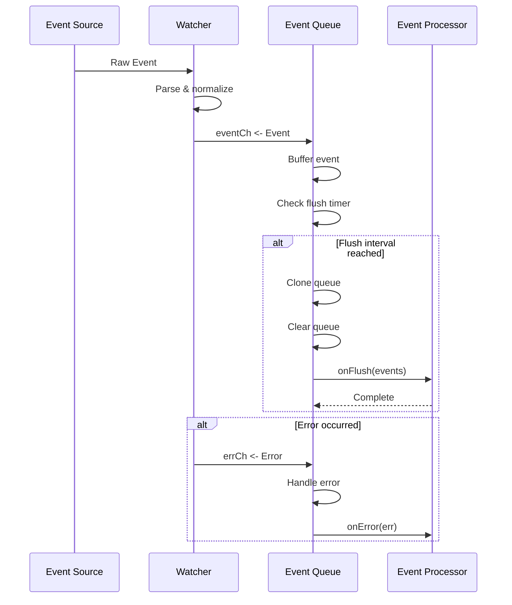
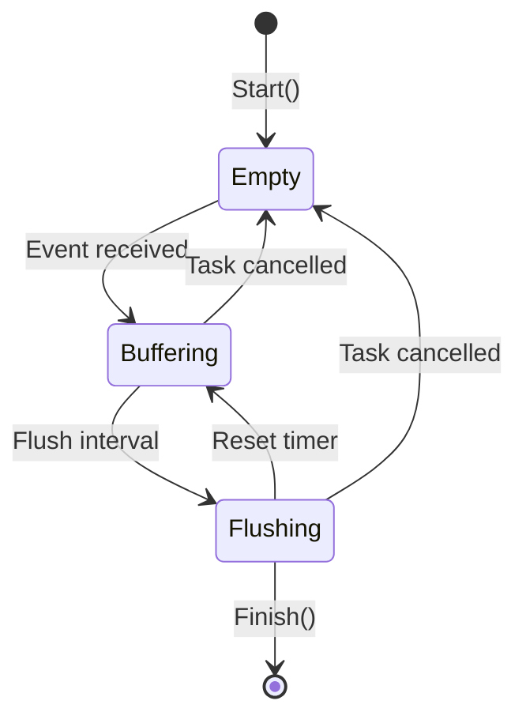

# Watcher Events

Defines event types and utilities for the watcher system, providing a unified way to handle Docker and file system events.

## Overview

The `internal/watcher/events` package defines the event model used throughout GoDoxy's watcher system. It provides types for container actions, file operations, and buffered event processing through the EventQueue.

### Primary Consumers

- `internal/watcher` - Docker and file watchers emit events
- `internal/route` - Route provider consumes events for configuration updates
- `internal/idlewatcher` - Consumes container lifecycle events

### Non-goals

- Does not implement event storage or persistence
- Does not provide event filtering (handled by watchers)
- Does not transform events (only normalization)

### Stability

Internal package. Event types and action constants are stable once defined.

## Public API

### Exported Types

#### Event

```go
type Event struct {
    Type            EventType           // Event source (docker, file)
    ActorName       string              // container name or file path
    ActorID         string              // container ID or empty
    ActorAttributes map[string]string   // container labels or empty
    Action          Action              // Specific action performed
}
```

Represents an event from any watcher source.

#### Action

```go
type Action uint16
```

Bitmask flags for event actions. Supports efficient group checking via bitwise operations.

**Container Actions:**

```go
const (
    ActionContainerCreate  Action = (1 << iota) // Container created
    ActionContainerStart                        // Container started
    ActionContainerUnpause                      // Container unpaused
    ActionContainerKill                         // Container killed
    ActionContainerStop                         // Container stopped
    ActionContainerPause                        // Container paused
    ActionContainerDie                          // Container died
    ActionContainerDestroy                      // Container destroyed
)
```

**File Actions:**

```go
const (
    ActionFileWritten  Action = (1 << iota) // File written/modified
    ActionFileCreated                       // File created
    ActionFileDeleted                       // File deleted
    ActionFileRenamed                       // File renamed
)
```

**Special Actions:**

```go
const (
    ActionForceReload Action = 1 << 10 // Force configuration reload
)
```

#### EventType

```go
type EventType string

const (
    EventTypeDocker EventType = "docker"
    EventTypeFile   EventType = "file"
)
```

### Event Methods

#### String

```go
func (e Event) String() string
```

Returns a human-readable representation: `"action actor_name"`.

**Example:**

```go
event := Event{Type: EventTypeDocker, ActorName: "nginx", Action: ActionContainerStart}
fmt.Println(event.String()) // "start nginx"
```

#### Action Classification

```go
func (a Action) IsContainerStart() bool
func (a Action) IsContainerStop() bool
func (a Action) IsContainerPause() bool
```

Efficiently check action categories using bitmask operations.

**Example:**

```go
if event.Action.IsContainerStart() {
    // Container is starting
}
```

### Event Queue

#### EventQueue

```go
type EventQueue struct {
    task          *task.Task
    queue         []Event
    ticker        *time.Ticker
    flushInterval time.Duration
    onFlush       OnFlushFunc
    onError       OnErrorFunc
}
```

Buffers events and flushes them in batches at configurable intervals.

#### Callbacks

```go
type OnFlushFunc = func(events []Event)
type OnErrorFunc = func(err gperr.Error)
```

Callbacks invoked when events are flushed or errors occur.

#### Constructor

```go
func NewEventQueue(queueTask *task.Task, flushInterval time.Duration, onFlush OnFlushFunc, onError OnErrorFunc) *EventQueue
```

Creates a new event queue.

**Lifecycle:**

- Queue starts via `Start(eventCh, errCh)` goroutine
- Events are buffered until flush interval
- On flush: queue is cloned, cleared, and `onFlush` is called
- Errors from error channel trigger `onError`
- Panics in `onFlush` are recovered and sent to `onError`
- Task cancellation discards remaining events

#### Start

```go
func (e *EventQueue) Start(eventCh <-chan Event, errCh <-chan gperr.Error)
```

Begins processing events from the channels. Must be called after construction.

### Event Mapping

#### DockerEventMap

```go
var DockerEventMap = map[dockerEvents.Action]Action{
    dockerEvents.ActionCreate:  ActionContainerCreate,
    dockerEvents.ActionStart:   ActionContainerStart,
    dockerEvents.ActionUnPause: ActionContainerUnpause,
    dockerEvents.ActionKill:    ActionContainerKill,
    dockerEvents.ActionStop:    ActionContainerStop,
    dockerEvents.ActionPause:   ActionContainerPause,
    dockerEvents.ActionDie:     ActionContainerDie,
    dockerEvents.ActionDestroy: ActionContainerDestroy,
}
```

Maps Docker event actions to watcher event actions.

## Architecture

### Event Flow



### Queue Behavior



### Core Components

| Component    | Responsibility                        |
| ------------ | ------------------------------------- |
| `Event`      | Unified event representation          |
| `Action`     | Bitmask for efficient action checking |
| `EventQueue` | Buffered batch processing of events   |

### Queue Capacity

```go
const eventQueueCapacity = 10
```

Queue has fixed capacity. Excess events may block the sender.

## Configuration Surface

EventQueue is configured at construction time:

| Parameter       | Type            | Default | Description                        |
| --------------- | --------------- | ------- | ---------------------------------- |
| `queueTask`     | `*task.Task`    | -       | Lifetime management                |
| `flushInterval` | `time.Duration` | -       | How often to flush buffered events |
| `onFlush`       | `OnFlushFunc`   | -       | Called with batch of events        |
| `onError`       | `OnErrorFunc`   | -       | Called on errors                   |

## Dependency and Integration Map

### Internal Dependencies

| Package                          | Purpose                                 |
| -------------------------------- | --------------------------------------- |
| `internal/common`                | Debug mode detection for panic handling |
| `github.com/yusing/goutils/task` | Lifetime management                     |

### External Dependencies

| Dependency             | Purpose            |
| ---------------------- | ------------------ |
| `github.com/moby/moby` | Docker event types |

### Integration Points

- Watchers emit events via channel to `EventQueue.Start()`
- Processors implement `OnFlushFunc` and `OnErrorFunc` callbacks

## Observability

### Logs

No direct logging in this package. Errors are propagated via callbacks.

### Metrics

None exposed.

## Failure Modes and Recovery

| Failure          | Detection                 | Recovery                          |
| ---------------- | ------------------------- | --------------------------------- |
| Channel closed   | `!ok` on receive          | Queue stops                       |
| Panic in onFlush | `recover()`               | Error sent to `onError`, continue |
| Task cancelled   | `<-task.Context().Done()` | Queue stops, events discarded     |
| Queue full       | `append()` blocks         | Sender blocks                     |

### Panic Recovery

```go
e.onFlush = func(events []Event) {
    defer func() {
        if errV := recover(); errV != nil {
            if err, ok := errV.(error); ok {
                e.onError(gperr.Wrap(err).Subject(e.task.Name()))
            } else {
                e.onError(gperr.New("recovered panic in onFlush").Withf("%v", errV).Subject(e.task.Name()))
            }
            if common.IsDebug {
                panic(string(debug.Stack()))
            }
        }
    }()
    origOnFlush(events)
}
```

In debug mode, panics are re-panicked after logging.

## Usage Examples

### Basic Event Queue Setup

```go
import (
    "context"
    "fmt"
    "time"
    "github.com/yusing/godoxy/internal/watcher/events"
    "github.com/yusing/goutils/task"
)

func setupEventQueue(ctx context.Context) *events.EventQueue {
    flushTask := task.Subtask("event-flush")

    return events.NewEventQueue(
        flushTask,
        5*time.Second,
        func(events []events.Event) {
            fmt.Printf("Flushed %d events:\n", len(events))
            for _, e := range events {
                fmt.Printf("  %s\n", e)
            }
        },
        func(err gperr.Error) {
            fmt.Printf("Error: %v\n", err)
        },
    )
}
```

### Integration with Docker Watcher

```go
import (
    "context"
    "github.com/yusing/godoxy/internal/watcher"
    "github.com/yusing/godoxy/internal/watcher/events"
    "github.com/yusing/goutils/task"
)

func watchContainers(ctx context.Context, dockerCfg types.DockerProviderConfig) error {
    dw := watcher.NewDockerWatcher(dockerCfg)
    eventCh, errCh := dw.Events(ctx)

    queue := events.NewEventQueue(
        task.Subtask("container-events"),
        10*time.Second,
        handleContainerEvents,
        logError,
    )

    queue.Start(eventCh, errCh)
    return nil
}

func handleContainerEvents(batch []events.Event) {
    for _, event := range batch {
        if event.Action.IsContainerStart() {
            log.Info().Str("container", event.ActorName).Msg("Container started")
        } else if event.Action.IsContainerStop() {
            log.Info().Str("container", event.ActorName).Msg("Container stopped")
        }
    }
}

func logError(err gperr.Error) {
    log.Error().Err(err).Msg("event queue error")
}
```

### Event Classification

```go
func classifyEvent(event events.Event) string {
    switch {
    case event.Type == events.EventTypeDocker:
        switch {
        case event.Action.IsContainerStart():
            return "container_start"
        case event.Action.IsContainerStop():
            return "container_stop"
        case event.Action == events.ActionContainerPause:
            return "container_pause"
        case event.Action == events.ActionForceReload:
            return "force_reload"
        }
    case event.Type == events.EventTypeFile:
        switch {
        case event.Action == events.ActionFileWritten:
            return "file_modified"
        case event.Action == events.ActionFileDeleted:
            return "file_deleted"
        }
    }
    return "unknown"
}
```

## Testing Notes

- Test with synthetic events via channel
- Verify batch ordering is preserved
- Test panic recovery by injecting panics in callback
- Verify task cancellation discards events correctly

## Related Packages

- `internal/watcher` - Watcher implementations that emit events
- `internal/task` - Task management for queue lifetime
- `internal/idlewatcher/provider` - Provider implementations using events
