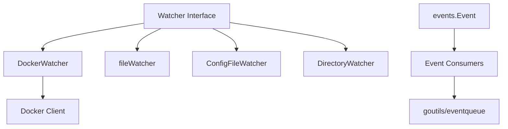
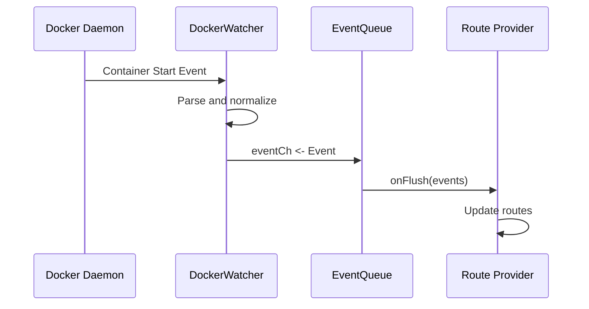
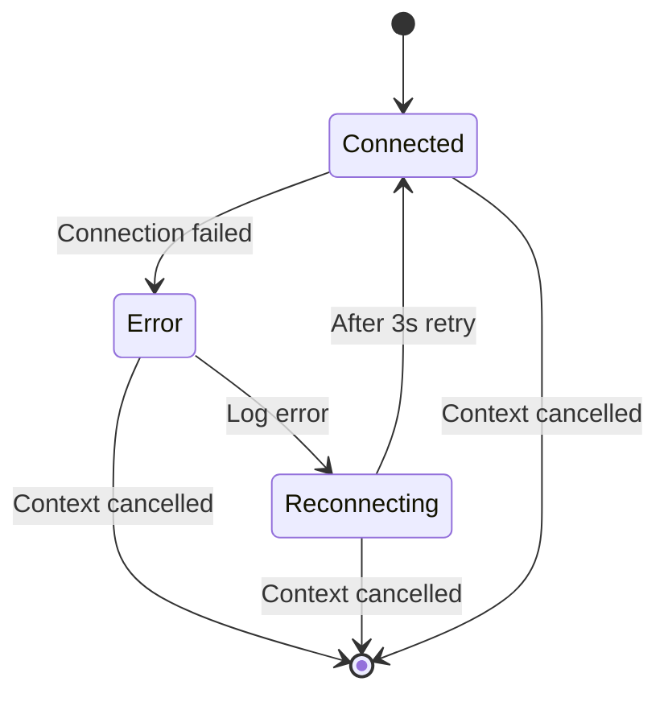

# Watcher

Provides file and Docker event watching capabilities for GoDoxy, enabling dynamic configuration updates.

## Overview

The watcher package implements event watching systems for detecting changes in configuration files and Docker containers. It provides a unified interface for event streaming that allows GoDoxy to react to infrastructure changes in real-time.

### Primary Consumers

- `internal/route` - Route provider reloads configuration on container events
- `internal/config` - Configuration file monitoring
- `internal/idlewatcher` - Container idle state detection

### Non-goals

- Does not provide a general-purpose filesystem watcher beyond configuration files
- Does not implement container orchestration or management operations
- Does not persist events beyond in-memory buffering

### Stability

Internal package. Public interfaces are stable, but implementation details may change.

## Public API

### Exported Types

#### Event Type

```go
type Event = events.Event
```

Alias to `events.Event` for convenience.

#### Watcher Interface

```go
type Watcher interface {
    // Events returns channels for receiving events and errors.
    // The channels are closed when the context is cancelled.
    Events(ctx context.Context) (<-chan Event, <-chan error)
}
```

Core interface that all watchers implement. Callers receive:

- `<-chan Event` - Events as they occur
- `<-chan error` - Errors during event watching

### Docker Watcher

#### Constructor

```go
func NewDockerWatcher(dockerCfg types.DockerProviderConfig) DockerWatcher
```

Creates a Docker watcher for the given Docker configuration.

#### Event Streaming

```go
func (w DockerWatcher) Events(ctx context.Context) (<-chan Event, <-chan error)
func (w DockerWatcher) EventsWithOptions(ctx context.Context, options DockerListOptions) (<-chan Event, <-chan error)
```

Returns event and error channels. `Events` uses default filters; `EventsWithOptions` allows custom filters.

#### Predefined Filters

```go
var (
    DockerFilterContainer = NewDockerFilter("type", string(dockerEvents.ContainerEventType))
    DockerFilterStart     = NewDockerFilter("event", string(dockerEvents.ActionStart))
    DockerFilterStop      = NewDockerFilter("event", string(dockerEvents.ActionStop))
    DockerFilterDie       = NewDockerFilter("event", string(dockerEvents.ActionDie))
    DockerFilterDestroy   = NewDockerFilter("event", string(dockerEvents.ActionDestroy))
    DockerFilterKill      = NewDockerFilter("event", string(dockerEvents.ActionKill))
    DockerFilterPause     = NewDockerFilter("event", string(dockerEvents.ActionPause))
    DockerFilterUnpause   = NewDockerFilter("event", string(dockerEvents.ActionUnPause))
)
```

Common filters for Docker event watching.

#### Filter Builder

```go
func NewDockerFilter(term string, values ...string) DockerFilter
func NewDockerFilters(filters ...DockerFilter) client.Filters
func DockerFilterContainerNameID(nameOrID string) DockerFilter
```

Create custom event filters.

## Architecture

### Core Components



| Component           | Responsibility                                         |
| ------------------- | ------------------------------------------------------ |
| `Watcher`           | Interface defining event streaming contract            |
| `DockerWatcher`     | Connects to Docker daemon and streams container events |
| `fileWatcher`       | Watches individual files for changes                   |
| `ConfigFileWatcher` | Watches configuration files for reloads                |
| `DirectoryWatcher`  | Watches directories for file changes                   |

### Event Flow



### Docker Event Processing

Events are parsed and mapped to watcher event types:

```go
func (w DockerWatcher) handleEvent(event dockerEvents.Message, ch chan<- Event) {
    action, ok := events.DockerEventMap[event.Action]
    if !ok {
        return // Unknown action, ignore
    }
    ch <- Event{
        Type:            events.EventTypeDocker,
        ActorID:         event.Actor.ID,
        ActorAttributes: event.Actor.Attributes,
        ActorName:       event.Actor.Attributes["name"],
        Action:          action,
    }
}
```

### Error Handling and Recovery



On connection errors:

1. Error is emitted to error channel
1. Force reload event is sent to clear routes
1. 3-second retry interval begins
1. On success, force reload triggers route reload
1. Event channel is reopened

## Configuration Surface

Docker watcher is configured via `types.DockerProviderConfig`:

- `Host` - Docker daemon socket/URL
- `Timeout` - Connection timeout

## Dependency and Integration Map

### Internal Dependencies

| Package                          | Purpose                                |
| -------------------------------- | -------------------------------------- |
| `internal/docker`                | Docker client management               |
| `internal/watcher/events`        | Event type definitions (Event, Action) |
| `internal/types`                 | Configuration types                    |
| `github.com/yusing/goutils/task` | Lifetime management                    |

### External Dependencies

| Dependency                       | Purpose                     |
| -------------------------------- | --------------------------- |
| `github.com/moby/moby`           | Docker API types and client |
| `github.com/rs/zerolog`          | Structured logging          |
| `github.com/yusing/goutils/errs` | Error handling              |

### Integration Points

- Events channel feeds into `goutils/eventqueue.EventQueue` for buffering
- Route provider subscribes to events for configuration reloads

## Observability

### Logs

| Level | Message Pattern                             | When                    |
| ----- | ------------------------------------------- | ----------------------- |
| Debug | Docker watcher opened/closed                | Connection lifecycle    |
| Error | docker watcher: failed to initialize client | Client creation failure |
| Debug | docker watcher: connection failed           | Reconnection attempts   |

### Metrics

None exposed directly. Polling metrics are tracked by the period package for uptime monitoring.

## Failure Modes and Recovery

| Failure                   | Detection                        | Recovery                 |
| ------------------------- | -------------------------------- | ------------------------ |
| Docker daemon unavailable | `client.IsErrConnectionFailed`   | Auto-retry every 3s      |
| Context cancellation      | `<-ctx.Done()`                   | Graceful shutdown        |
| Unknown event actions     | Missing in `DockerEventMap`      | Event ignored (no error) |
| Channel blocked writing   | 3-second timeout on notification | Event dropped, continue  |

### Panic Recovery

The Docker watcher does not recover from panics in the event loop. Panic will terminate the process.

## Usage Examples

### Basic Docker Event Watching

```go
import (
    "context"
    "github.com/yusing/godoxy/internal/watcher"
    "github.com/yusing/godoxy/internal/types"
)

func watchContainers(ctx context.Context, dockerCfg types.DockerProviderConfig) error {
    dw := watcher.NewDockerWatcher(dockerCfg)
    eventCh, errCh := dw.Events(ctx)

    for {
        select {
        case <-ctx.Done():
            return nil
        case event := <-eventCh:
            handleContainerEvent(event)
        case err := <-errCh:
            log.Error().Err(err).Msg("docker watcher error")
        }
    }
}

func handleContainerEvent(event watcher.Event) {
    switch event.Action {
    case events.ActionContainerStart:
        log.Info().Str("container", event.ActorName).Msg("Container started")
    case events.ActionContainerStop, events.ActionContainerDie:
        log.Info().Str("container", event.ActorName).Msg("Container stopped")
    case events.ActionContainerDestroy:
        log.Info().Str("container", event.ActorName).Msg("Container destroyed")
    }
}
```

### Custom Event Filters

```go
import "github.com/yusing/godoxy/internal/watcher"

options := watcher.DockerListOptions{
    Filters: watcher.NewDockerFilters(
        watcher.DockerFilterContainer,
        watcher.DockerFilterStart,
        watcher.DockerFilterContainerNameID("my-app"),
    ),
}

dw := watcher.NewDockerWatcher(cfg)
eventCh, errCh := dw.EventsWithOptions(ctx, options)
```

## Testing Notes

- Mock Docker client via `internal/docker` package
- Event queue can be tested with synthetic events
- Connection failures tested via `client.IsErrConnectionFailed` simulation

## Related Packages

- `internal/watcher/events` - Event type definitions (Event, Action, EventType)
- `goutils/eventqueue` - Generic buffered event queue
- `internal/docker` - Docker client management
- `internal/route/routes` - Route management
