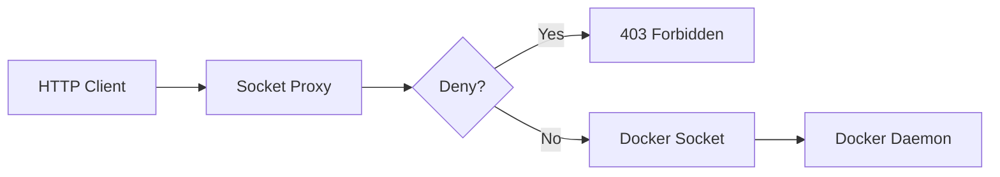

# socket-proxy/cmd

The entry point for the Docker Socket Proxy sub-project, a secure proxy that exposes the Docker socket with fine-grained access control.

## Overview

This package provides a minimal main entry point that starts the Docker socket proxy server. The proxy acts as a gatekeeper, allowing or denying access to Docker API endpoints based on configured permissions.

This is similar to [lscr.io/linuxserver/socket-proxy](https://github.com/linuxserver/docker-socket-proxy) but:

- **No EOF errors**: Properly handles keep-alive connections to avoid occasional EOF errors that plague other implementations
- **GoDoxy integration**: Designed to work seamlessly with GoDoxy for container auto-discovery and route management

## Architecture



## Main Function

```go
func main() {
    // Validates that ListenAddr is set
    // Starts HTTP server on configured address
    // Uses socketproxy.NewHandler() for request routing
}
```

## Configuration

The socket proxy is configured via environment variables:

| Variable             | Description                      | Default                |
| -------------------- | -------------------------------- | ---------------------- |
| `DOCKER_SOCKET`      | Path to Docker socket            | `/var/run/docker.sock` |
| `LISTEN_ADDR`        | Address to listen on             | (empty - disabled)     |
| `DOCKER_SOCKET_ADDR` | Alternative name for LISTEN_ADDR | (empty)                |

## Usage

```bash
# Start the socket proxy
DOCKER_SOCKET=/var/run/docker.sock LISTEN_ADDR=:2375 go run main.go
```

## Related Packages

- `socketproxy/pkg` - Core proxy implementation with route handling and reverse proxy logic
