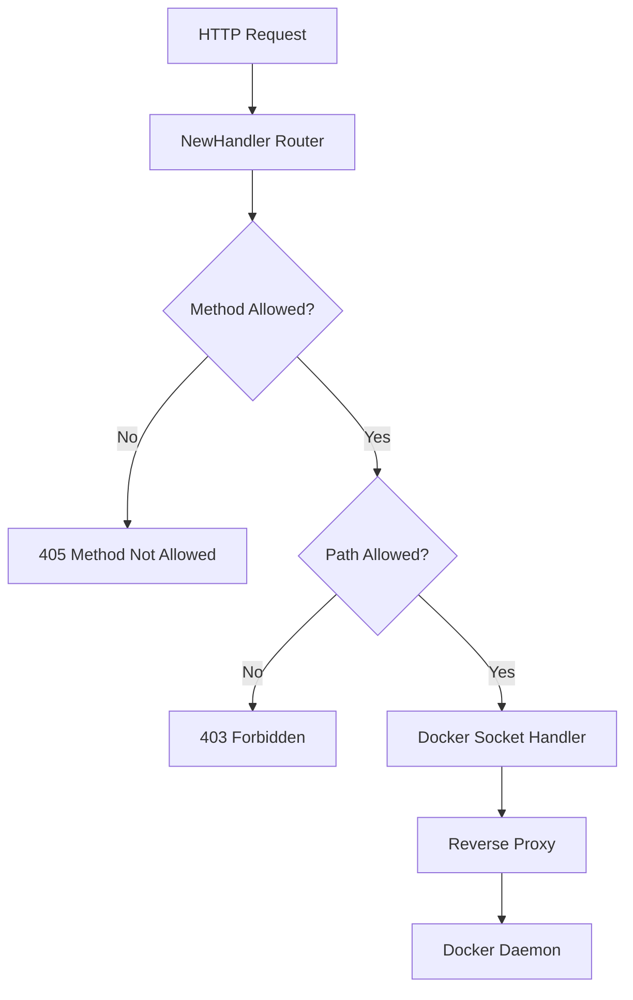

# socket-proxy/pkg

Core package for the Docker Socket Proxy, providing secure access to the Docker API with endpoint filtering and access control.

## Overview

This package implements a secure proxy that controls access to Docker socket API endpoints. It supports fine-grained permissions for different Docker operations and can restrict HTTP methods (GET-only or GET+POST).

## Architecture



## Core Components

### Environment Configuration (`env.go`)

Global configuration flags loaded from environment variables:

| Variable           | Type   | Default                | Description                 |
| ------------------ | ------ | ---------------------- | --------------------------- |
| `DockerSocket`     | string | `/var/run/docker.sock` | Path to Docker socket       |
| `ListenAddr`       | string | (empty)                | HTTP listen address         |
| `DockerPost`       | bool   | `false`                | Allow POST methods          |
| `DockerRestarts`   | bool   | `false`                | Allow container restarts    |
| `DockerStart`      | bool   | `false`                | Allow container starts      |
| `DockerStop`       | bool   | `false`                | Allow container stops       |
| `DockerAuth`       | bool   | `false`                | Allow /auth endpoints       |
| `DockerBuild`      | bool   | `false`                | Allow /build endpoints      |
| `DockerCommit`     | bool   | `false`                | Allow /commit endpoints     |
| `DockerContainers` | bool   | `false`                | Allow /containers endpoints |
| `DockerEvents`     | bool   | `true`                 | Allow /events endpoints     |
| `DockerExec`       | bool   | `false`                | Allow /exec endpoints       |
| `DockerImages`     | bool   | `false`                | Allow /images endpoints     |
| `DockerInfo`       | bool   | `false`                | Allow /info endpoints       |
| `DockerNetworks`   | bool   | `false`                | Allow /networks endpoints   |
| `DockerPing`       | bool   | `true`                 | Allow /\_ping endpoints     |
| `DockerServices`   | bool   | `false`                | Allow /services endpoints   |
| `DockerSystem`     | bool   | `false`                | Allow /system endpoints     |
| `DockerVersion`    | bool   | `true`                 | Allow /version endpoints    |
| `DockerVolumes`    | bool   | `false`                | Allow /volumes endpoints    |

### Request Handler (`handler.go`)

The `NewHandler()` function creates an HTTP router with:

- Path-based access control (allowed/denied paths)
- HTTP method filtering (GET-only or GET+POST)
- Version prefix support (e.g., `/v1.41/containers`)
- Unix domain socket proxying

### Reverse Proxy (`reverseproxy/reverse_proxy.go`)

Based on Go's standard library reverse proxy with enhancements:

- Hop-by-hop header removal
- WebSocket/h2c upgrade handling
- Trailer support
- Context-aware request cancellation

## Usage Example

```go
package main

import (
    "log"
    "net/http"
    socketproxy "github.com/yusing/godoxy/socketproxy/pkg"
)

func main() {
    // Configuration is loaded from environment variables
    if socketproxy.ListenAddr == "" {
        log.Fatal("Docker socket address is not set")
    }
    log.Printf("Docker socket listening on: %s", socketproxy.ListenAddr)
    http.ListenAndServe(socketproxy.ListenAddr, socketproxy.NewHandler())
}
```

## Security Features

1. **Endpoint Whitelisting**: Only explicitly allowed endpoints are accessible
1. **Method Restrictions**: Can restrict to GET-only or allow POST
1. **Connection Keep-Alive**: Maintains persistent connections to Docker socket
1. **Header Filtering**: Removes hop-by-hop headers to prevent spoofing

## Docker Integration

The proxy connects to the Docker daemon via Unix socket and proxies all allowed requests. The Docker API version prefix is handled automatically for backward compatibility.
